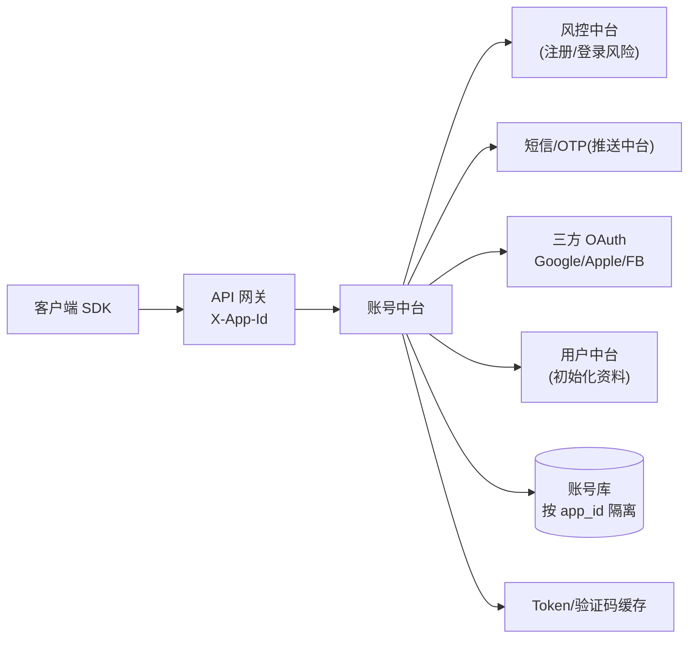
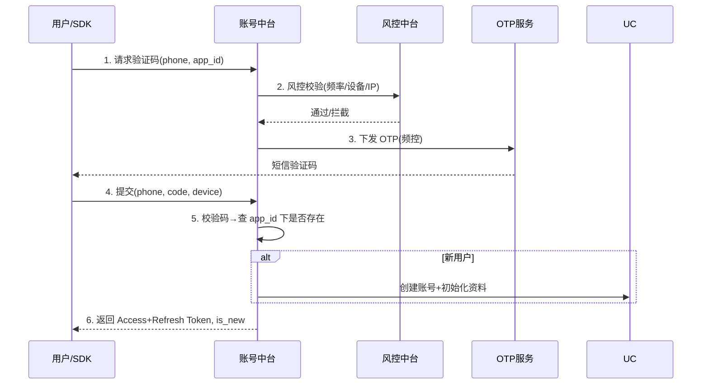
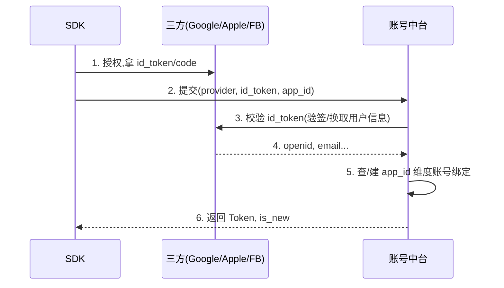

# 账号登录注册中台 · PRD

| 项 | 内容 |
|---|---|
| 版本 | v1.0 |
| 状态 | 评审稿 |
| 错误码段 | 2xxxx |
| 依赖 | 风控中台(09)、用户中台(07)、多语言(04)、推送(12,短信OTP) |

---

## 一、背景与目标

多产品/马甲包各自做登录,重复且不合规。账号中台统一提供**多方式登录、Token 体系、设备管理、账号生命周期**,新产品接 SDK 即用。
- **复用**:一套登录能力支撑 N 个 App。
- **隔离**:账号数据按 appId 隔离,**不跨 App 关联**(防主体关联,见总览 §4)。
- **合规**:游客模式、年龄门、隐私同意、可注销(GDPR,见 10 篇)。

## 二、范围

| In Scope | Out of Scope |
|---|---|
| 手机号 OTP、三方 OAuth(Google/Apple/Facebook)、游客登录、账号绑定/解绑、Token 签发与刷新、设备管理、登出、注销、封禁联动 | 用户资料/关系链(→用户中台)、支付(→支付中台)、实名 KYC(→风控/支付) |

## 三、名词
- **游客(Guest)**:未注册即可体验,后续可转正。
- **主身份**:手机号或三方账号,游客升级后绑定。
- **Access/Refresh Token**:短期访问凭证 + 长期刷新凭证。

---

## 四、整体架构



---

## 五、核心功能模块

1. 登录注册(手机号 OTP / 三方 / 游客)
2. Token 体系(签发/校验/刷新/吊销)
3. 设备管理(多端登录、踢出、设备指纹联动风控)
4. 账号绑定(游客转正、绑多个三方、换绑手机号)
5. 账号生命周期(登出、注销、封禁/解封联动)
6. 安全(防撞库、OTP 频控、异地登录提醒)

---

## 六、关键业务流程（交互原型 · 时序图）

### 6.1 手机号 OTP 登录/注册（自动判断新老用户）



### 6.2 三方 OAuth 登录（Google/Apple/Facebook）



### 6.3 Token 刷新与吊销
- Access 过期 → 用 Refresh 换新 Access;Refresh 过期/被吊销 → 重新登录。
- 封禁/异常 → 吊销该用户全部 Token,强制下线。

---

## 七、交互原型（ASCII 线框）

### 7.1 登录首页（客户端）
```
┌───────────────────────────────┐
│            [App Logo]          │
│        欢迎来到 XXX 语聊房        │
│                                │
│   ┌─────────────────────────┐  │
│   │  📱 手机号登录            │  │  ← 主按钮
│   └─────────────────────────┘  │
│   ──────────  或  ───────────   │
│   [  Google ] [ Apple ] [ FB ] │  ← 三方一键(按平台/地区显隐)
│                                │
│        以游客身份先逛逛 >        │  ← 游客入口(降门槛)
│                                │
│  登录即同意《用户协议》《隐私政策》 │  ← 合规(多语言/RTL)
└───────────────────────────────┘
```
**交互说明**
- 三方按钮**按地区/平台动态显隐**(iOS 必带 Apple 登录;FB 在被封地区隐藏)。
- 文案/排版走多语言中台,阿语自动 RTL。
- 点协议跳对应 appId 的隐私政策(每产品独立域名)。

### 7.2 验证码页
```
┌───────────────────────────────┐
│  ‹ 返回                         │
│  输入验证码                      │
│  已发送至 +966 5XX XXX XXX       │
│   ┌─┐ ┌─┐ ┌─┐ ┌─┐ ┌─┐ ┌─┐       │
│   │ │ │ │ │ │ │ │ │ │ │ │       │  ← 6 位
│   └─┘ └─┘ └─┘ └─┘ └─┘ └─┘       │
│   重新发送(59s)                  │  ← 倒计时+频控
└───────────────────────────────┘
```

### 7.3 游客转正/补充资料页（首次注册）
```
┌───────────────────────────────┐
│  完善资料(1/1)                  │
│  [ 头像上传 ]  ← 过审核(06)      │
│  昵称: [____________]           │
│  性别: ( ) 男 ( ) 女            │
│  生日: [____]  ← 年龄门(合规)    │
│         [   进入 App   ]        │
└───────────────────────────────┘
```

### 7.4 账号与安全设置（端内）
```
账号与安全
  绑定手机号        +966 5XX...      ›
  Google           已绑定 ✓          ›
  Apple            未绑定            ›
  登录设备管理      3 台 → 可踢出     ›
  注销账号          ›   ← 合规必备(冷静期/数据删除)
```

---

## 八、核心接口（节选）

| 接口 | 方法 | 入参 | 出参 |
|---|---|---|---|
| `/auth/otp/send` | POST | phone, app_id, scene | cooldown |
| `/auth/otp/login` | POST | phone, code, device | access, refresh, is_new |
| `/auth/oauth/login` | POST | provider, id_token, device | access, refresh, is_new |
| `/auth/guest/login` | POST | device, app_id | access, refresh, guest_id |
| `/auth/token/refresh` | POST | refresh | access |
| `/auth/bind` | POST | provider/phone, credential | ok |
| `/auth/logout` | POST | — | ok |
| `/auth/deactivate` | POST | reason | ok(进入注销流程) |

**通用错误码(2xxxx)**:`20001 验证码错误`/`20002 频率超限`/`20003 三方校验失败`/`20004 账号封禁`/`20005 设备风险拦截`。

---

## 九、数据模型（核心,按 app_id 隔离）

```
account
  id, app_id, status(active/banned/deleted),
  reg_source(otp/google/apple/fb/guest), reg_country,
  created_at, last_login_at
account_identity   # 一个账号可绑多身份
  id, account_id, app_id, type(phone/google/apple/fb),
  identifier(脱敏/哈希), verified
device
  id, account_id, app_id, device_id, platform,
  push_token, last_active, risk_tag
token            # 通常存缓存
  account_id, app_id, refresh_jti, device_id, expire_at
```
> ⚠️ `account` 以 `app_id` 隔离;**跨 app 不做 identifier 关联查询**(防主体关联)。

---

## 十、多产品复用与隔离
- SDK 按 `appKey` 初始化,所有请求带 `X-App-Id`。
- 登录方式开关、协议链接、OTP 模板、三方 AppId **按 appId 配置**(运营后台)。
- 数据物理/逻辑隔离;风控阈值按 appId。

## 十一、非功能需求
- 性能:登录 P99 < 500ms;OTP 下发 < 3s。
- 可用性:99.95%;Token 校验走缓存。
- 安全:OTP 频控(分钟/小时/天三级)、防撞库、异地提醒、PII 加密。
- 合规:游客可用、年龄门、隐私同意留痕、注销冷静期+数据删除(10 篇)。

## 十二、埋点
`register_start/success(reg_source, country)`、`login_success(method)`、`otp_send/verify(result)`、`oauth_result`、`bind_result`、`deactivate`。

## 十三、异常与边界
- 验证码超时/错误/频控;三方 token 失效;同手机号在多 app(各自独立账号);封禁用户登录拦截;弱网重试幂等(请求幂等键)。

## 十四、验收标准
- [ ] 四种登录(OTP/Google/Apple/游客)全通,新老用户自动判别。
- [ ] Token 签发/刷新/吊销、设备踢出生效。
- [ ] 游客转正、三方绑定/解绑、换绑手机。
- [ ] 注销流程合规(冷静期+数据删除)。
- [ ] 按 appId 隔离,跨 app 不关联;风控/年龄门/隐私同意接入。
- [ ] 多语言 + RTL 登录页;埋点齐全。
