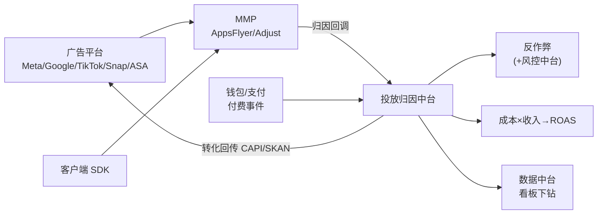
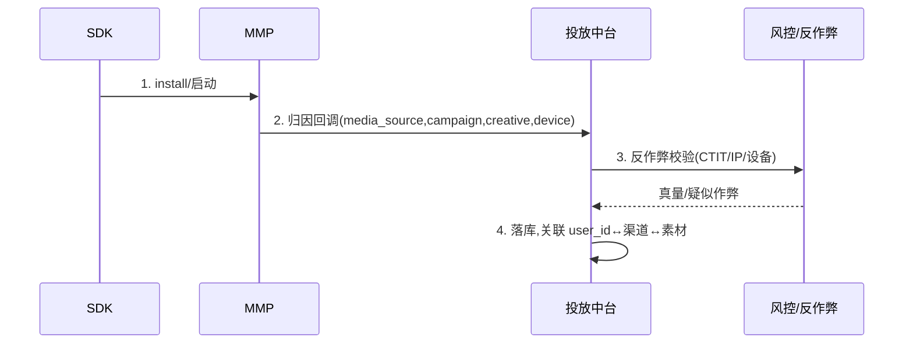
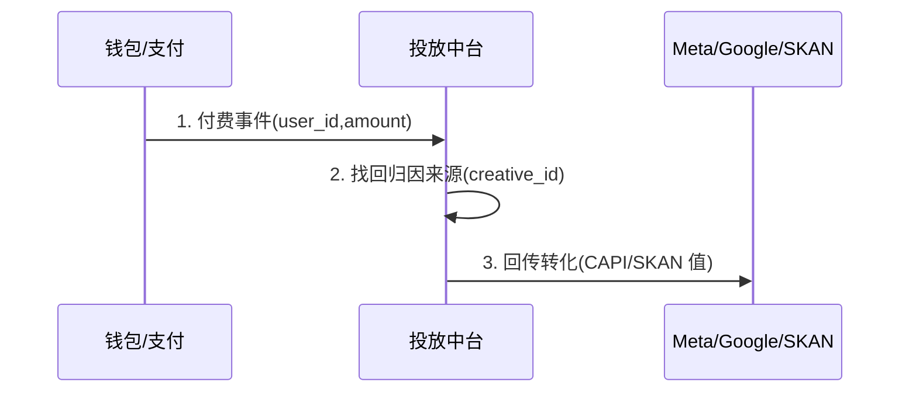

# 投放归因中台 · PRD

| 项 | 内容 |
|---|---|
| 版本 | v1.0 |
| 状态 | 评审稿 |
| 错误码段 | 4xxxx |
| 依赖 | 数据中台(13)、风控中台(09,反作弊)、钱包/支付(付费事件)、运营中台(活动) |

---

## 一、背景与目标

多产品买量,渠道/归因/反作弊/ROAS 各做各的=盲投+浪费。投放中台统一:
- **归因**:对接 MMP(AppsFlyer/Adjust/Singular),统一 install→渠道映射。
- **反作弊**:统一识别刷量/点击劫持/设备农场。
- **ROAS/回传**:统一成本与付费回传(Meta CAPI/Google/SKAN),按 appId×国家×渠道×素材下钻。
- **复用**:新产品接 SDK + 配 MMP key 即可有完整投放数据。

## 二、范围
| In | Out |
|---|---|
| 渠道管理、归因接入、Deferred Deeplink、反作弊、素材/广告户台账、成本回传、ROAS 计算与看板 | 实际投放操作(在各广告平台)、行为分析(→数据中台)、风控决策引擎(→风控中台) |

---

## 三、整体架构



---

## 四、核心功能

1. **渠道/活动台账**:media_source、campaign、adset、creative 层级。
2. **归因接入**:MMP S2S 回调入库,统一 install/event 归因。
3. **Deferred Deeplink**:落地页→下载→还原来源/落地场景。
4. **反作弊**:点击-安装时间差(CTIT)、IP/设备异常、转化率异常、与风控中台联动。
5. **成本接入**:拉各平台花费(API/手工),与收入匹配。
6. **转化回传**:付费/关键事件回传 Meta CAPI、Google、Apple SKAN(隐私聚合)。
7. **ROAS 引擎**:D0/D7/D30 ROAS、回本周期,按 appId×国家×渠道×素材。

---

## 五、关键流程（交互原型 · 时序）

### 5.1 归因


### 5.2 付费回传(提升广告平台模型)


---

## 六、交互原型（投放后台 · ASCII）

### 6.1 ROAS 总览看板
```
投放总览     App:[语聊房A ▾]  国家:[全部▾]  日期:[近7天▾]
┌──────────────┬───────────┬──────────┬──────────┬──────────┐
│ 渠道          │ 花费       │ 新增      │ CPI      │ D7 ROAS  │
├──────────────┼───────────┼──────────┼──────────┼──────────┤
│ Meta          │ $12,300   │ 8,200    │ $1.50    │ 0.72 ↑   │
│ Google UAC    │ $9,800    │ 6,100    │ $1.61    │ 0.65 →   │
│ TikTok        │ $4,200    │ 3,500    │ $1.20    │ 0.81 ↑   │  ← 高亮达标
│ ASA(iOS)      │ $3,100    │ 1,400    │ $2.21    │ 0.90 ↑   │
└──────────────┴───────────┴──────────┴──────────┴──────────┘
[下钻:素材 creative_id ▾]   [导出]   [⚠ 疑似作弊量:3.2%]
```

### 6.2 素材台账（与素材脚本库/埋点对齐）
```
素材  creative_id: SA_H1_v3_cta2_15s_0712
  钩子:热闹夜聊  渠道:Meta  状态:●在投
  曝光 120k | CTR 4.1% | 注册成本 $1.3 | 次留 38% | D7 ROAS 0.79
  [暂停] [放大预算] [做变体]
```

### 6.3 反作弊告警
```
反作弊  App:语聊房A
  ⚠ 渠道X CTIT 异常(<10s 占比 62%) → 建议加黑
  ⚠ 设备农场特征 480 设备 → 已自动排除归因
  [查看明细] [加入黑名单] [申诉]
```

---

## 七、核心接口
| 接口 | 方法 | 说明 |
|---|---|---|
| `/ua/attr/callback` | POST | MMP S2S 归因回调入库 |
| `/ua/event/postback` | POST | 付费/关键事件触发回传 |
| `/ua/cost/sync` | POST | 同步各平台花费 |
| `/ua/roas/query` | GET | 按维度查 ROAS |
| `/ua/fraud/flag` | POST | 反作弊标记 |
| `/ua/creative` | GET/POST | 素材台账 |

`4xxxx`:`40001 归因数据缺失`/`40002 重复回调(幂等)`/`40003 成本同步失败`。

## 八、数据模型
```
attribution  user_id, app_id, media_source, campaign, adset, creative_id,
             country, install_ts, is_organic, fraud_tag
ua_cost      app_id, channel, campaign, date, spend, currency
ua_revenue   app_id, channel, creative_id, date, revenue (来自付费事件)
creative     creative_id, app_id, hook_type, channel, status, metrics_json
```

## 九、多产品复用与隔离
- 每 appId 独立 MMP App + 独立广告账户(防主体关联);中台统一接入但**数据按 appId 隔离**。
- ROAS/反作弊规则模板共享,阈值按 appId/国家配置。

## 十、非功能 / 埋点 / 异常
- 归因回调幂等(dedup by install_id);回传隐私合规(SKAN/Consent)。
- 埋点见数据中台;成本/收入对齐 D-1 可校准。
- 异常:MMP 延迟回调、成本 API 限流、回传失败重试队列。

## 十一、验收标准
- [ ] MMP 归因回调入库,user↔渠道↔素材可关联。
- [ ] 付费事件回传 Meta/Google/SKAN 成功。
- [ ] 反作弊标记并从归因/ROAS 中剔除。
- [ ] ROAS 看板按 appId×国家×渠道×素材下钻。
- [ ] 按 appId 隔离,广告账户/MMP 独立。
