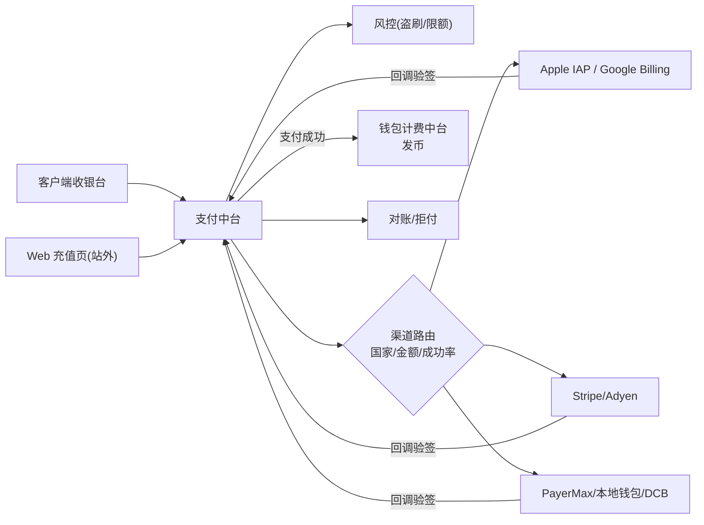
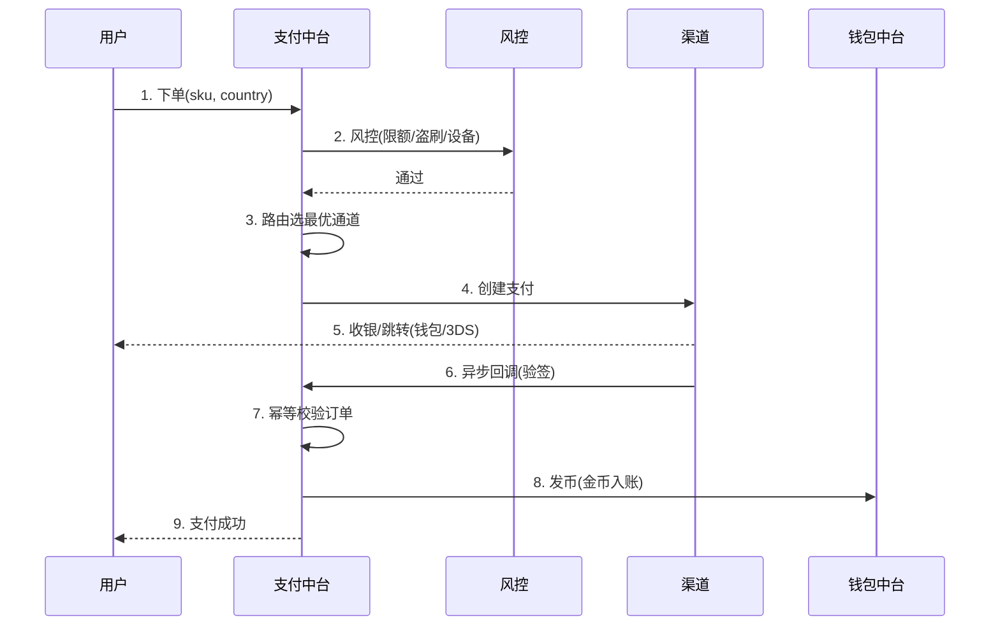
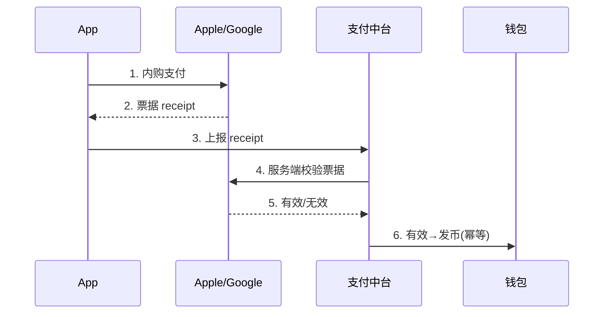
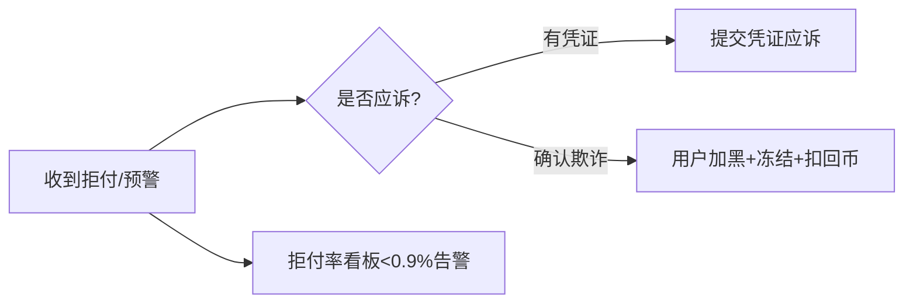

# 支付中台 · PRD

| 项 | 内容 |
|---|---|
| 版本 | v1.0 |
| 状态 | 评审稿 |
| 错误码段 | 3xxxx |
| 依赖 | 钱包计费(08,发币)、风控(09,反盗刷)、账号(01)、合规(10,主体/税务) |

---

## 一、背景与目标

多产品多国收单,渠道分散、对账混乱、拒付失控。支付中台统一:
- **多渠道收单**:IAP/Google Play Billing + 卡(Stripe/Adyen)+ 本地支付(mada/STC Pay/UPI/GoPay/运营商代扣)。
- **智能路由**:按国家/金额/成功率选最优通道。
- **订单/对账/拒付/退款**一体化。
- **合规边界**:App 内数字内容**必走 IAP**;第三方支付仅用于 Web/站外(见 09 支付篇)。
- **隔离**:**每产品独立收单主体**(防主体关联冻结,见总览 §4)。

## 二、范围
| In | Out |
|---|---|
| 收银台、渠道路由、下单、回调验签、IAP 校验、订单管理、对账、拒付、退款、风控前置 | 发币/余额(→钱包中台)、提现(→钱包/主播公会)、资金回流架构(→合规 10 篇) |

---

## 三、整体架构



---

## 四、核心功能
1. **收银台**:充值档位、支付方式(按国家显隐)、首充礼包。
2. **渠道路由**:国家×金额×成功率×费率动态选路;失败自动降级备用通道。
3. **下单与回调**:统一下单、异步回调验签、幂等发币。
4. **IAP 校验**:Apple/Google 服务端票据校验,防越权/重放。
5. **订单管理**:状态机、查询、补单。
6. **对账**:与渠道日切对账,差错处理。
7. **拒付(Chargeback)**:预警(Ethoca/Verifi)、应诉、黑名单。
8. **退款**:规则+审批。

## 五、关键流程（交互原型 · 时序）

### 5.1 充值（本地支付/卡，App 外 Web 或合规场景）


### 5.2 IAP 校验（App 内数字内容，合规必走）


### 5.3 拒付处理


## 六、交互原型（ASCII）

### 6.1 客户端收银台
```
┌───────────────────────────────┐
│  充值                       ✕  │
│  当前金币: 1,200 💰             │
│  ┌───────┐┌───────┐┌────────┐  │
│  │首充特惠││ 19 SAR ││ 75 SAR │  │  ← 档位(本地货币)
│  │+200%🔥││ +小赠送││ +中赠送 │  │
│  └───────┘└───────┘└────────┘  │
│  支付方式:                      │
│  ( ) mada   ( ) STC Pay        │  ← 按国家显隐
│  ( ) Apple Pay  ( ) 运营商代扣  │
│         [    确认支付    ]      │
│  支付遇到问题? 联系客服 ›        │  ← 充值失败入口(13篇)
└───────────────────────────────┘
```

### 6.2 支付后台（运营/财务）
```
订单管理   App:[语聊房A▾] 状态:[全部▾] 渠道:[全部▾]
order_id   user   金额    渠道    状态     时间
10293..    u_88   19 SAR  mada    成功     12:03
10294..    u_91   99 USD  Stripe  拒付⚠   11:40 [应诉]
────────────────────────────────────────────
对账: mada 今日 1,204 笔 ✓ 差异 0
拒付率: 0.4% (阈值 0.9%) ●正常
```

## 七、核心接口
| 接口 | 方法 | 说明 |
|---|---|---|
| `/pay/order/create` | POST | 下单(sku,country,scene) |
| `/pay/iap/verify` | POST | IAP 票据校验 |
| `/pay/callback/{channel}` | POST | 渠道异步回调(验签) |
| `/pay/order/query` | GET | 订单状态 |
| `/pay/refund` | POST | 退款 |
| `/pay/chargeback/handle` | POST | 拒付处置 |
| `/pay/channel/route` | GET | 路由决策(内部) |

`3xxxx`:`30001 验签失败`/`30002 重复回调(幂等)`/`30003 IAP票据无效`/`30004 风控拦截`/`30005 渠道不可用降级`。

## 八、数据模型
```
pay_order  order_id, app_id, user_id, sku, amount, currency, country,
           channel, status(created/paying/success/fail/refund), pay_ts
pay_channel_conf  app_id, country, channel, fee_rate, priority, enabled,
                  merchant_id(每产品独立主体)
chargeback  order_id, app_id, reason, status, evidence, ts
refund      order_id, amount, reason, status
```

## 九、多产品复用与隔离（关键合规）
- **每 appId 配独立收单主体/商户号**(防主体关联冻结)。
- 渠道路由策略模板共享,具体商户/费率/通道按 appId×country 配置。
- 数字内容走 IAP;Web 充值用第三方,**App 内不放外部支付跳转**(除非目标国政策允许,见 09)。

## 十、非功能 / 安全 / 埋点
- 发币**幂等**(order_id 唯一);回调验签;金额服务端校验(防篡改)。
- 性能:下单 P99<800ms;回调处理可重试队列。
- 安全:3DS、限额、设备风控、PII 加密。
- 埋点:`recharge_start/success/fail(channel,fail_reason,is_first)`(对齐数据中台)。

## 十一、异常与边界
- 回调丢失→主动查询补单;重复回调→幂等;退款与拒付冲突处理;跨时区对账;通道故障自动降级。

## 十二、验收标准
- [ ] IAP + 至少 2 个本地通道(mada/STC Pay)收单成功,幂等发币。
- [ ] 渠道路由 + 失败降级生效。
- [ ] 对账日切、差错可处理;拒付预警与应诉闭环,拒付率看板。
- [ ] 每 appId 独立商户主体;App 内无外部支付跳转。
- [ ] 风控前置 + 大额复核;埋点齐全。
