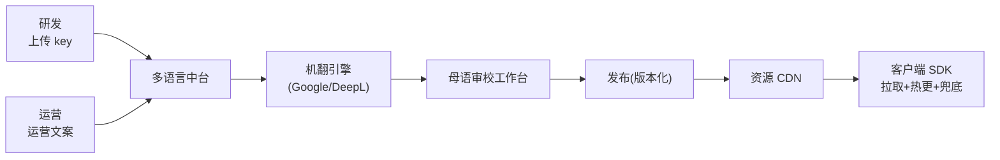
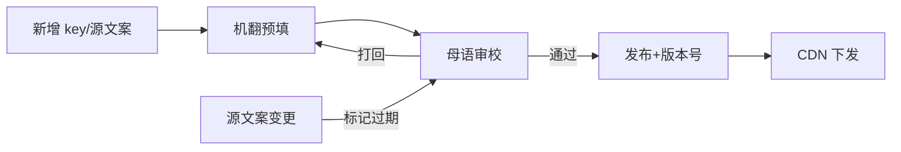

# 多语言本地化中台 · PRD

| 项 | 内容 |
|---|---|
| 版本 | v1.0 |
| 状态 | 评审稿 |
| 错误码段 | 8xxxx |
| 依赖 | 运营中台(文案投放)、内容审核(译文合规)、数据中台 |

---

## 一、背景与目标

多产品多语言(阿/英/印尼/土/葡/西…),硬编码文案 + 各自翻译 = 体验割裂、上线慢、RTL 踩坑。本中台统一:
- **文案资源平台**:key-value 多语言,客户端**热更新**(改文案不发版)。
- **翻译工作流**:待译→机翻→母语人审→发布,沉淀术语库/记忆库。
- **RTL + 区域格式**:阿语/希伯来语镜像;货币/日期/数字按区域。
- **复用**:所有产品共用平台,namespace 按 appId+模块隔离,公共文案可共享。

## 二、范围
| In | Out |
|---|---|
| 文案资源管理、多语言下发/热更、翻译工作流、术语库、RTL/复数/性别/占位符、区域格式化、运营文案本地化 | UI 布局镜像实现(客户端工程)、机翻引擎本身(接三方)、语音/内容审核(→06) |

---

## 三、整体架构


## 四、核心功能
1. **资源管理**:`namespace.key` → 各语言文案;支持占位符 `{name}`、复数、性别变体。
2. **翻译工作流**:状态机(待译/机翻/待审/已发布/过期);母语人审。
3. **术语库 + 翻译记忆**:统一品牌词/术语,复用历史译文。
4. **多语言下发**:按 app_id+language+version 拉取;**热更新**;缺失**兜底默认语言**。
5. **RTL 支持**:标记 RTL 语言,提供方向元数据;校验镜像。
6. **区域格式化**:货币(SAR/AED)、日期、数字、姓名顺序。
7. **运营文案本地化**:活动/Push/礼包文案接入同一工作流。

## 五、关键流程（交互原型 · 时序）

### 5.1 翻译工作流


### 5.2 客户端下发与热更
```mermaid
sequenceDiagram
  participant S as SDK
  participant C as 资源CDN
  S->>C: 启动:拉取(app_id,lang,ver)
  C-->>S: 增量资源包/最新版本
  S->>S: 命中本地→渲染;缺失→兜底默认语言
  Note over S: 运营改文案→推送新版本→热更生效(不发版)
```

## 六、交互原型（多语言后台 · ASCII）

### 6.1 文案管理
```
文案管理   App:[公共/语聊房A▾]  模块:[room▾]  语言:[ar ▾]
key                    en(源)            ar(译)         状态
room.join_btn          Join Room         انضم للغرفة     ●已发布
room.empty_hint        No one here yet   لا أحد هنا...   ⚠待审
gift.send              Send Gift         (空)            ✕缺失→兜底
[批量机翻] [导出XLIFF] [+新增key]    RTL:ar ✓
```

### 6.2 翻译工作台（母语审校）
```
待审 (ar)   12 条
┌────────────────────────────────────────────┐
│ key: room.empty_hint                         │
│ 源(en): No one here yet, start the party!    │
│ 机翻(ar): لا أحد هنا بعد، ابدأ الحفلة!         │
│ 审校: [______________________]  ← 母语修改     │
│ 术语提示:"party"→统一译"حفلة"                  │
│        [通过并发布]   [打回]                  │
└────────────────────────────────────────────┘
```

## 七、核心接口
| 接口 | 方法 | 说明 |
|---|---|---|
| `/i18n/resource` | GET | 拉取(app_id,lang,version)→增量包 |
| `/i18n/key` | POST | 新增/更新 key |
| `/i18n/translate` | POST | 触发机翻 |
| `/i18n/review` | POST | 审校通过/打回 |
| `/i18n/publish` | POST | 发布版本 |
| `/i18n/locale/format` | GET | 区域格式规则(货币/日期) |

`8xxxx`:`80001 key不存在(兜底)`/`80002 语言不支持`/`80003 资源版本冲突`。

## 八、数据模型
```
i18n_key      id, app_id(或 common), namespace, key, source_text, status
i18n_value    key_id, language, text, status(mt/review/published), updated_at
i18n_term     term, lang, preferred_translation     # 术语库
i18n_version  app_id, language, version, package_url # 版本化下发
locale_format country, currency, date_fmt, number_fmt, rtl(bool)
```

## 九、多产品复用与隔离
- **公共命名空间**(common)放通用文案,各 app 复用;`app_id` 命名空间放产品专属。
- 译文/术语库跨产品复用(同语言),降低翻译成本。
- RTL/格式规则全局共享。

## 十、非功能 / 异常
- 热更:增量下发、CDN 缓存、灰度按 app/百分比。
- 兜底:缺失 key→默认语言→显示 key(开发态)。
- 一致性:源文案变更→相关译文标记"过期待审"。
- 性能:资源包压缩;首屏关键文案内置防白屏。

## 十一、验收标准
- [ ] key-value 多语言管理 + 占位符/复数/性别。
- [ ] 翻译工作流(机翻→母语审→发布)+ 术语库。
- [ ] 客户端热更 + 缺失兜底;阿语 RTL 元数据与格式化。
- [ ] 公共/产品命名空间复用;按 app×lang×version 下发。
- [ ] 运营文案接入同一工作流。
