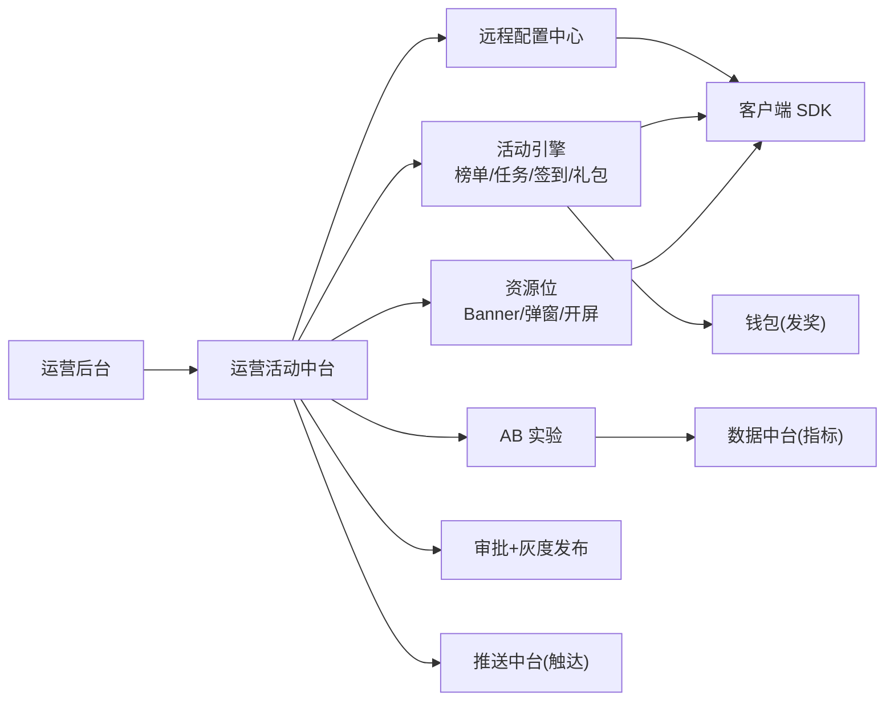
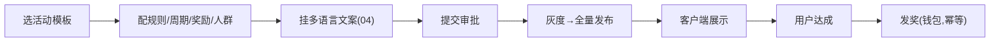
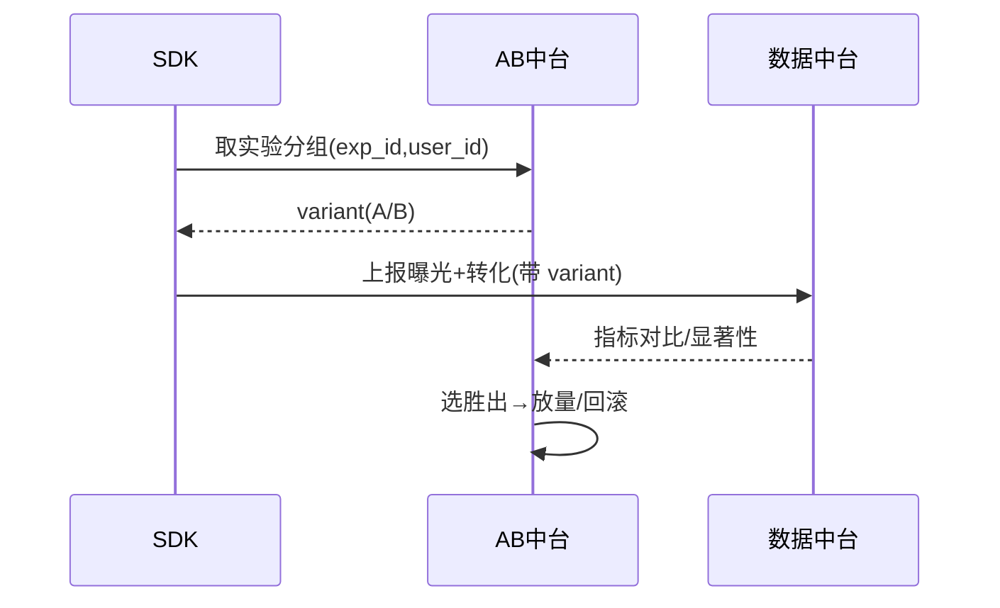

# 运营活动中台 · PRD

| 项 | 内容 |
|---|---|
| 版本 | v1.0 |
| 状态 | 评审稿 |
| 错误码段 | 7xxxx |
| 依赖 | 多语言(04)、推送召回(12)、钱包(08,发奖)、数据(13,AB)、内容审核(06) |

---

## 一、背景与目标

多产品运营靠发版 = 慢、不灵活。运营中台让运营**不发版**就能配活动、资源位、远程配置、AB、节点(斋月)运营。
- **配置化**:活动/榜单/任务/签到/礼包模板化。
- **资源位**:Banner/弹窗/开屏统一投放。
- **远程配置 + AB**:开关/参数/实验。
- **复用**:活动模板跨产品复用,按 appId 配置生效。

## 二、范围
| In | Out |
|---|---|
| 活动配置、资源位、远程配置、AB 实验、运营日历、审批灰度、发奖编排 | 推送通道(→12)、发币(→08)、数据看板(→13)、文案翻译(→04) |

---

## 三、整体架构


## 四、核心功能
1. **活动引擎**:模板(榜单/累充返利/签到/任务/抽奖)→ 配规则/周期/奖励 → 发布。
2. **资源位管理**:位置、素材(多语言)、人群、时间、优先级、频控。
3. **远程配置**:开关/参数(按 app/国家/版本/人群),热生效。
4. **AB 实验**:分流、指标、显著性、放量/回滚。
5. **运营日历**:节点(斋月等)排期与提醒。
6. **审批与灰度**:发布前审批,按百分比/国家灰度。
7. **发奖编排**:活动达成→调钱包发币/道具(幂等)。

## 五、关键流程（交互原型 · 时序）

### 5.1 活动配置→发布→发奖


### 5.2 AB 实验


## 六、交互原型（运营后台 · ASCII）

### 6.1 活动列表
```
活动管理   App:[语聊房A▾]  [+新建活动]
名称           类型     周期            状态    人群     操作
斋月累充返利    充值返利  2/8-3/10        ●进行中  全部     [数据][停]
新人7日签到     签到     长期            ●进行中  新用户   [编辑]
周末PK赛        榜单     每周五-日        ◷待发布  房主     [审批]
```

### 6.2 资源位配置
```
资源位:首页Banner
  素材:[banner_ar.png] 多语言:ar/en/tr  ← 接04
  跳转:活动「斋月累充」                  ← deeplink
  人群:沙特+UAE  版本:≥2.3  时间:2/1-3/10
  频控:每用户每日1次   优先级:高
  状态: ◷待审批  [提交审批]
```

### 6.3 AB 实验
```
实验:首充礼包样式  exp_id:rc_pack_v2
  分流:A 50% / B 50%   指标:首充转化率
  A(对照):0.99美元包    B(实验):本地SAR包+加赠
  结果:B +18% (置信 96%) → [放量B] [回滚]
```

### 6.4 远程配置
```
配置中心   App:语聊房A
  key                值        范围            生效
  room.gift_combo    true      全部            热生效
  match.ai_warmup    false     非高峰          灰度10%
  recharge.web_entry false     沙特(政策)       —
```

## 七、核心接口
| 接口 | 方法 | 说明 |
|---|---|---|
| `/op/config` | GET | 拉远程配置(app,country,ver,user) |
| `/op/activity/list` | GET | 生效活动 |
| `/op/activity/progress` | POST | 上报进度 |
| `/op/activity/reward` | POST | 发奖(幂等,调钱包) |
| `/op/slot` | GET | 资源位投放 |
| `/op/ab/assign` | GET | AB 分组 |
| `/op/publish` | POST | 审批/灰度发布 |

`7xxxx`:`70001 活动未生效`/`70002 重复领奖(幂等)`/`70003 不在人群`/`70004 频控限制`。

## 八、数据模型
```
activity     id, app_id, template, rule_json, start, end, audience, status
op_config    app_id, key, value, scope(country/ver/group), gray_percent
slot         id, app_id, position, material_i18n, audience, time, freq, priority
ab_experiment id, app_id, variants_json, metric, traffic, status
reward_log   user_id, app_id, activity_id, reward, idempotency_key, ts
```

## 九、多产品复用与隔离
- 活动/资源位/AB **模板共享**,实例按 appId 配置。
- 远程配置、AB 分流按 appId 隔离;运营日历可复用节点(斋月)模板。

## 十、非功能 / 异常
- 配置/活动热生效、灰度、审批留痕;发奖幂等(idempotency_key)。
- 异常:活动超发兜底(库存/上限)、AB 分流稳定(同用户固定组)、资源位降级(加载失败不阻塞)。

## 十一、验收标准
- [ ] 活动模板可配置发布、发奖幂等。
- [ ] 资源位多语言+人群+频控+灰度。
- [ ] 远程配置热生效;AB 分流稳定+指标+放量回滚。
- [ ] 运营日历(斋月)排期;审批留痕。
- [ ] 模板跨产品复用,配置按 appId 隔离。
