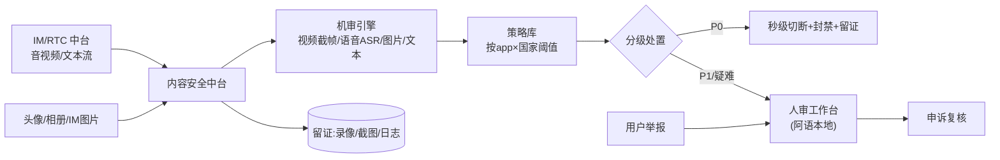
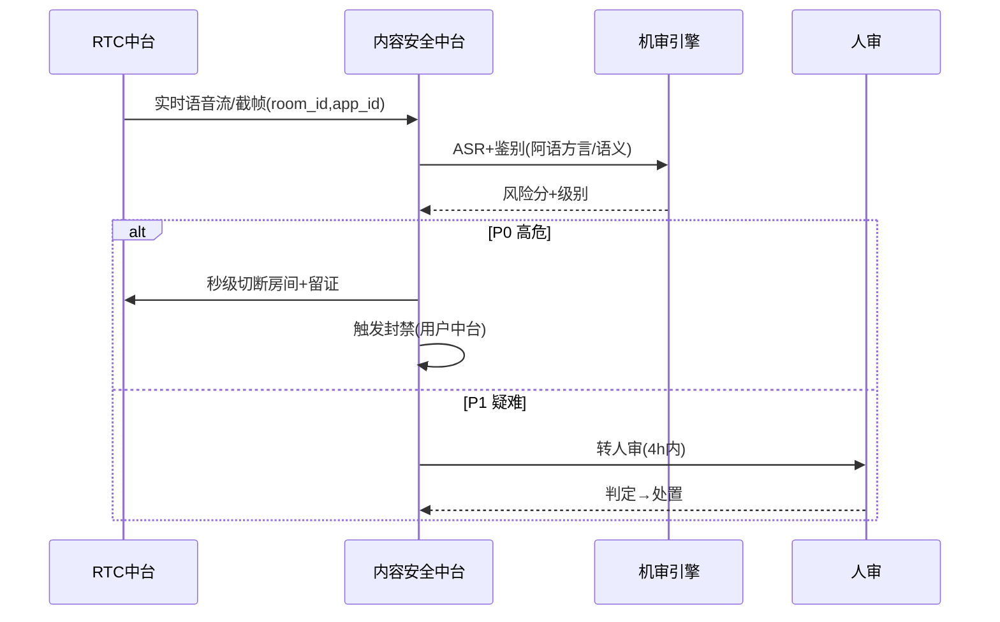
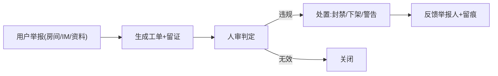

# 内容安全审核中台 · PRD

| 项 | 内容 |
|---|---|
| 版本 | v1.0 |
| 状态 | 评审稿 |
| 错误码段 | 5xxxx |
| 依赖 | IM/RTC(10,流接入)、风控(09)、用户(07,封禁)、运营(06,数据) |
| ⚠️ | **生死线中台**:一次大漏判→整号团灭+连坐矩阵(见《07 内容安全与审核》《阿语审核外包》细案) |

---

## 一、背景与目标

多产品真人音视频社交,审核各做各的=漏洞百出。本中台统一:
- **机审 + 人审** 双层,覆盖**实时视频/实时语音/图片/文本**四模态。
- **实时拦截 + 留证**;**分级处置**(P0/P1/P2);**举报闭环**;**分区域尺度**(海湾最严)。
- **策略库共享**,执行阈值按 appId×国家配置。

## 二、范围
| In | Out |
|---|---|
| 多模态机审接入、实时拦截、分级处置、人审工作台、举报闭环、留证、策略库、申诉、未成年人识别 | RTC 流本身(→10)、账号封禁执行(→01/07)、支付反欺诈(→09) |

---

## 三、整体架构


## 四、核心功能
1. **多模态机审**:视频截帧鉴黄暴恐、语音 ASR+语义(阿语方言)、图片识别、文本敏感词+语义(多语言)。
2. **实时拦截**:P0 秒级切断直播/房间。
3. **分级处置**:P0(切断+封禁)/P1(警告/打码/限流→人审)/P2(折叠/降权/抽检)。
4. **人审工作台**:任务队列、证据回放、判定、绩效(对接《阿语审核外包》考核)。
5. **举报闭环**:举报→工单→处置→反馈→留痕。
6. **留证**:录像/截图/日志,供申诉与监管举证。
7. **策略库**:规则模板共享,阈值/红线按 appId×国家配置(海湾最严)。
8. **未成年人识别**:疑似未成年模型+处置。

## 五、关键流程（交互原型 · 时序）

### 5.1 实时语音房审核


### 5.2 举报处置


## 六、交互原型（ASCII）

### 6.1 人审工作台
```
人审队列  App:[全部▾] 级别:[P1▾] 语言:[ar▾]   待处理:38
┌──────────────────────────────────────────────┐
│ 工单#5521  类型:语音房  级别:P1  风险:性暗示0.78 │
│ ▶ 回放(留证 30s)   房间:r_8842  用户:u_91       │
│ 文本ASR:"..."(阿语+译文)                        │
│ 处置: ( )通过 ( )警告 ( )打码 ( )封禁15天 ( )永封 │
│       [提交]   [升级P0]   [转主管]              │
└──────────────────────────────────────────────┘
质检:本人今日准确率 98.6% | 漏判 0 | 时效达标 ✓
```

### 6.2 举报与策略后台
```
举报管理  App:语聊房A  今日:124 处置率98% 平均时效2.1h
策略库  国家:[沙特▾]
  规则                 阈值/动作
  露点/性器官          0.5 → P0秒切+永封
  性暗示着装           0.7 → P1人审
  涉政/宗教敏感        命中 → P0+上报
  未成年人特征         0.6 → P0+核查
  [海湾尺度=最严 ✓]  [复制到其他国家]
```

## 七、核心接口
| 接口 | 方法 | 说明 |
|---|---|---|
| `/mod/stream/check` | POST | 实时流/截帧送审 |
| `/mod/text/check` | POST | 文本/IM 同步审 |
| `/mod/image/check` | POST | 图片/头像审 |
| `/mod/realtime/cut` | POST | 秒级切断(内部) |
| `/mod/report` | POST | 用户举报 |
| `/mod/task/handle` | POST | 人审处置 |
| `/mod/appeal` | POST | 申诉 |
| `/mod/policy` | GET/POST | 策略库(按app×country) |

`5xxxx`:`50001 命中P0已拦截`/`50002 送审超时(默认拦截高危)`/`50003 留证失败告警`。

## 八、数据模型
```
mod_record  id, app_id, modality(video/audio/img/text), target(room/user/msg),
            risk_score, level(P0/P1/P2), action, evidence_url, country, ts
report      id, app_id, reporter, target, reason, status, handler, result, ts
policy      app_id, country, rule, threshold, action
audit_human handler_id, task_id, decision, accuracy, miss_flag, latency
```

## 九、多产品复用与隔离
- 机审能力、人审工作台、策略模板**共享**;**阈值/红线按 appId×country 配置**(海湾最严)。
- 留证数据按 appId 隔离,最小访问+水印+留痕(数据安全)。

## 十、非功能 / 合规
- 实时性:P0 拦截秒级;送审超时→默认按高危处理(宁误伤不漏放)。
- 可用性:机审降级→提高人审比例;引擎多供应商容灾。
- 合规:留证按区域存储(数据本地化,10 篇);未成年人保护。
- 机审结果回流训练,降人审压力。

## 十一、验收标准
- [ ] 四模态机审接入,实时语音/视频 P0 秒级切断+留证。
- [ ] 分级处置 SOP + 人审工作台 + 绩效质检(对接审核外包细案)。
- [ ] 举报全场景闭环 + 反馈留痕;申诉复核。
- [ ] 策略库按 appId×国家配置,海湾最严;未成年人识别。
- [ ] 漏判零容忍指标接入考核;留证数据安全合规。
