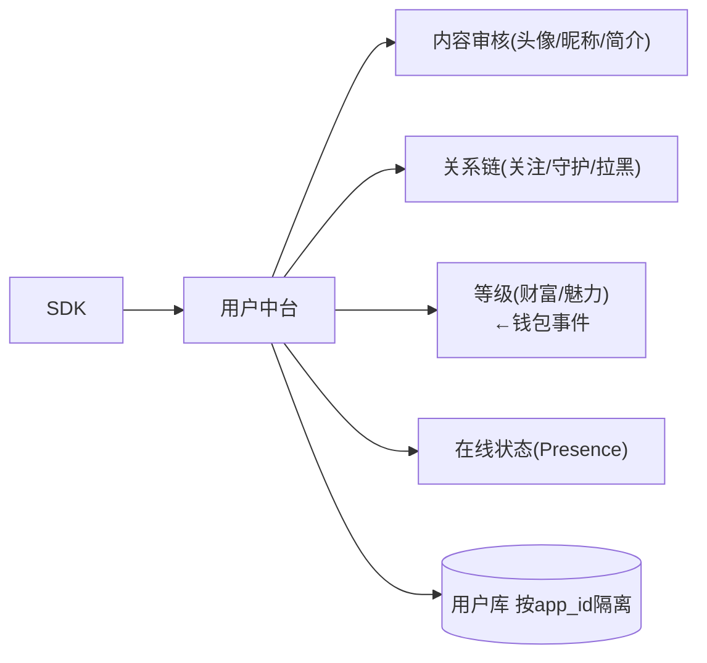

# 用户中台 · PRD

| 项 | 内容 |
|---|---|
| 版本 | v1.0 |
| 状态 | 评审稿 |
| 错误码段 | 2xxxx(与账号共段) |
| 依赖 | 账号(01)、内容审核(06,资料审核)、钱包(08,等级)、数据(13,画像) |

---

## 一、背景与目标
统一**用户资料、关系链、等级体系、在线状态、画像**,供多产品复用。账号中台管"登录身份",用户中台管"社交身份与资产"。

## 二、范围
| In | Out |
|---|---|
| 资料(头像/昵称/性别/生日/简介/标签)、关系链(关注/好友/守护/拉黑)、等级(财富/魅力)、在线状态、画像标签、资料审核联动 | 登录/Token(→01)、礼物/余额(→08)、内容审核引擎(→06) |

## 三、整体架构


## 四、核心功能
1. **资料管理**:头像/昵称/性别/生日/简介/地区/标签;**头像昵称简介过审**(06)。
2. **关系链**:关注/粉丝、好友、**守护/铁粉**、拉黑、最近访客。
3. **等级体系**:财富等级(充值消费)、魅力等级(收礼);特权/标识。
4. **在线状态**:在线/忙碌/隐身;最近活跃。
5. **画像标签**:兴趣/语言/活跃时段/付费层(供匹配、推荐、运营)。
6. **隐私**:谁能看资料/在线/拉黑屏蔽。

## 五、交互原型（ASCII）

### 5.1 个人资料页
```
┌───────────────────────────────┐
│ [头像]  昵称 ✦Lv.财富12 ✿魅力8  │
│ ID:88231  🇸🇦 沙特  ●在线         │
│ 简介: 喜欢深夜语聊~              │
│ 关注 120 | 粉丝 3.4k | 守护 56   │
│ [ 关注 ] [ 私信 ] [ 送礼 ] [⋯]  │  ← ⋯:拉黑/举报
│ ── 标签: #音乐 #夜聊 #阿语 ──     │
│ ── TA的房间 / 守护榜 ──          │
└───────────────────────────────┘
```

### 5.2 关系/守护列表
```
我的关系   [关注][粉丝][好友][守护]
  ✿ 守护中  主播A   亲密度 8420  ›
  ✿ 守护中  主播B   亲密度 5100  ›
  关注      用户C   ●在线         [私信]
  拉黑名单(3)                     ›
```

## 六、核心接口
| 接口 | 方法 | 说明 |
|---|---|---|
| `/user/profile` | GET/PUT | 资料(更新触发审核) |
| `/user/relation/follow` | POST | 关注/取关 |
| `/user/relation/guard` | POST | 守护 |
| `/user/relation/block` | POST | 拉黑 |
| `/user/level` | GET | 财富/魅力等级 |
| `/user/presence` | GET/POST | 在线状态 |
| `/user/tags` | GET | 画像标签 |

## 七、数据模型
```
user_profile  user_id, app_id, nickname, avatar, gender, birthday,
              bio, country, language, status, review_state
relation      user_id, app_id, target_id, type(follow/friend/guard/block),
              intimacy, created_at
user_level    user_id, app_id, wealth_lv, charm_lv, exp
user_tag      user_id, app_id, tag, source
```

## 八、多产品复用与隔离
- 一套资料/关系/等级模型,**数据按 app_id 隔离**(同一自然人在不同 app 是不同用户,**不跨 app 关联**,防主体关联)。
- 等级/标签规则模板共享,参数按 appId 配置。

## 九、非功能 / 异常 / 验收
- 资料更新→**审核通过前展示旧值/默认**(防违规头像直出)。
- 关系链高并发(关注/守护)缓存+异步计数。
- 验收:[ ] 资料CRUD+审核联动;[ ] 关注/守护/拉黑;[ ] 财富魅力等级;[ ] 在线状态;[ ] 画像标签;[ ] 按 appId 隔离不跨 app。
