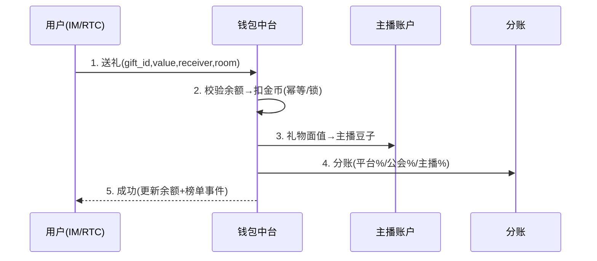
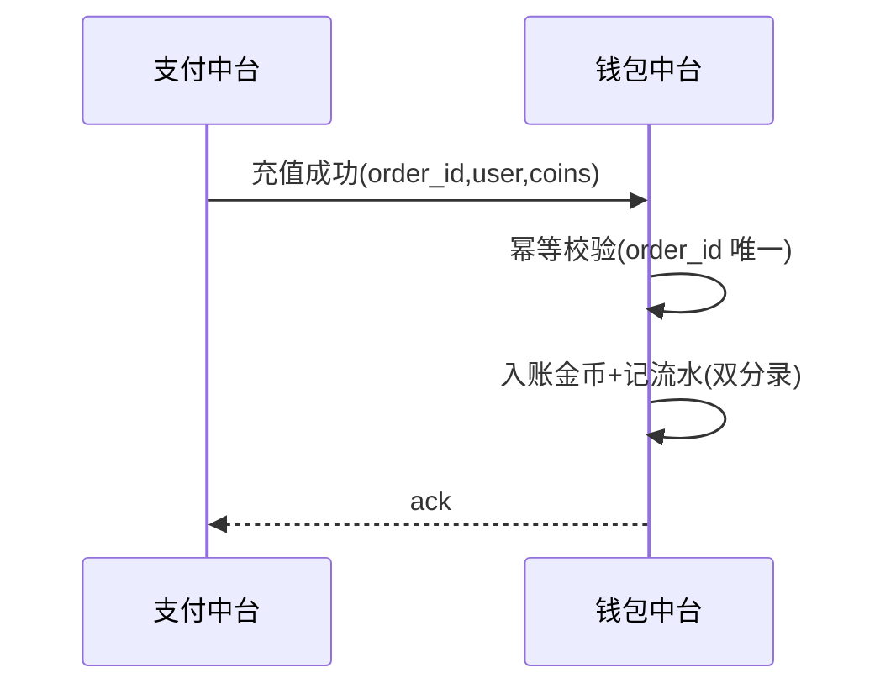

# 钱包计费中台 · PRD

| 项 | 内容 |
|---|---|
| 版本 | v1.0 |
| 状态 | 评审稿 |
| 错误码段 | 3xxxx(与支付共段) |
| 依赖 | 支付(03,充值入账)、主播公会(11,提现/分账)、风控(09)、运营(05,发奖) |

---

## 一、背景与目标
统一**虚拟货币账户(金币/钻石/豆子)、计费、订单流水、分账、对账、提现**。支付中台负责"把钱收进来",钱包中台负责"币的账"。
- **一致性铁律**:充值入账、送礼扣币、分账、提现**全幂等、可对账、不丢不重**。

## 二、范围
| In | Out |
|---|---|
| 多币种账户、充值入账、消费(送礼)扣币、收益(豆子)、分账(平台/公会/主播)、流水台账、对账、提现发起、兑换 | 收单(→03)、提现出款通道(→03/主播公会)、资金回流(→10 合规) |

## 三、整体架构
```mermaid
flowchart LR
  PAY["支付中台\n充值成功"] -->|发币(幂等)| WMID["钱包计费中台"]
  GIFT["送礼(IM/RTC)"] -->|扣金币| WMID
  WMID -->|收礼→豆子| ANCHOR["主播账户"]
  WMID --> SPLIT["分账\n平台/公会/主播"]
  ANCHOR -->|提现申请| WD["提现(→支付/公会)"]
  WMID --> LEDGER[("流水/总账 按app_id")]
  WMID --> RISK["风控(异常/盗刷)"]
```

## 四、核心功能
1. **账户体系**:金币(充值币)/钻石(高阶)/豆子(结算币),按 user×app。
2. **充值入账**:支付成功回调→发币(**幂等 by order_id**)。
3. **消费扣币**:送礼/买特权→扣金币(余额校验、幂等、防并发超扣)。
4. **收益与分账**:礼物面值→主播豆子,按规则**分账平台/公会/主播**(对接分成协议)。
5. **提现**:豆子→申请→KYC/风控→出款(对接支付/主播公会)。
6. **流水台账 + 对账**:每笔双分录,日切对账。
7. **兑换**:金币↔钻石↔豆子按配置比率。

## 五、关键流程（交互原型 · 时序）

### 5.1 送礼扣币 → 主播入账 → 分账


### 5.2 充值入账（幂等）


## 六、交互原型（ASCII）

### 6.1 钱包页（端内）
```
┌───────────────────────────────┐
│  我的钱包                       │
│  金币 💰 1,200    钻石 💎 30     │
│  [ 充值 ]                       │
│  ── 主播收益 ──                 │
│  豆子 🫘 42,000 ≈ $200          │
│  [ 提现 ]  本月已提 $150        │
│  交易记录 ›                     │
└───────────────────────────────┘
```

### 6.2 财务对账后台
```
对账中心  App:语聊房A  日期:06-19
充值入账   12,304 笔  ✓与支付一致
送礼扣币   88,210 笔  ✓
分账       平台¥.. 公会¥.. 主播¥..  ✓
差异       0 笔
提现       申请 320 | 通过 290 | KYC待核 30
[导出] [差错工单]
```

## 七、核心接口
| 接口 | 方法 | 说明 |
|---|---|---|
| `/wallet/credit` | POST | 充值/发奖入账(幂等) |
| `/wallet/debit` | POST | 送礼/消费扣币(幂等+锁) |
| `/wallet/balance` | GET | 余额 |
| `/wallet/income` | POST | 主播收益入账 |
| `/wallet/split` | POST | 分账 |
| `/wallet/withdraw/apply` | POST | 提现申请(→KYC/风控) |
| `/wallet/ledger` | GET | 流水 |

`3xxxx`:`30101 余额不足`/`30102 重复入账(幂等)`/`30103 并发冲突重试`/`30104 提现风控拦截`。

## 八、数据模型
```
wallet_account  user_id, app_id, currency(coin/crystal/bean), balance, version(乐观锁)
wallet_txn      txn_id, app_id, user_id, type(credit/debit/income/split/withdraw),
                currency, amount, ref_id(order/gift), idempotency_key, ts
split_record    txn_id, app_id, platform_cut, guild_cut, anchor_cut, guild_id
withdraw        id, app_id, anchor_id, amount, kyc_status, status, channel
```

## 九、多产品复用与隔离
- 账户/流水/分账模型共享;**余额与流水按 app_id 隔离**。
- 分账比例、兑换比率、提现规则按 appId 配置(对接《代理结算与分成协议》)。

## 十、非功能（强一致）
- **幂等**(idempotency_key/order_id)、**乐观锁/分布式锁**防并发超扣、**双分录**可对账。
- 最终一致:分账/榜单异步,但扣币/入账同步事务。
- 风控:异常大额、刷币、对敲识别(→09)。

## 十一、验收标准
- [ ] 充值入账/送礼扣币/收益/分账/提现全链路幂等、可对账。
- [ ] 余额并发安全(锁/乐观锁),无超扣。
- [ ] 日切对账差异为 0;提现 KYC/风控前置。
- [ ] 按 appId 隔离;分账规则配置化对接分成协议。
