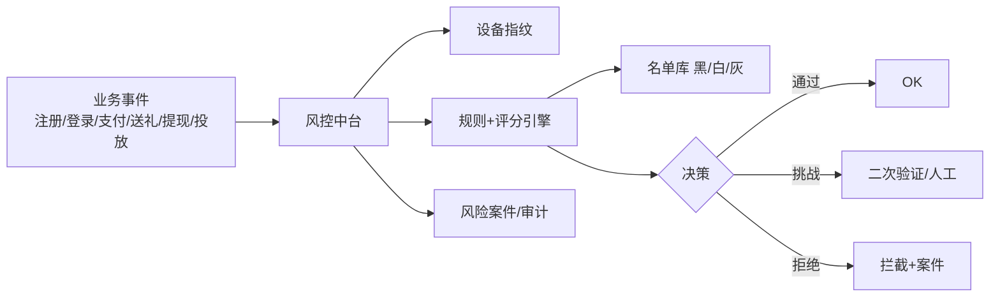
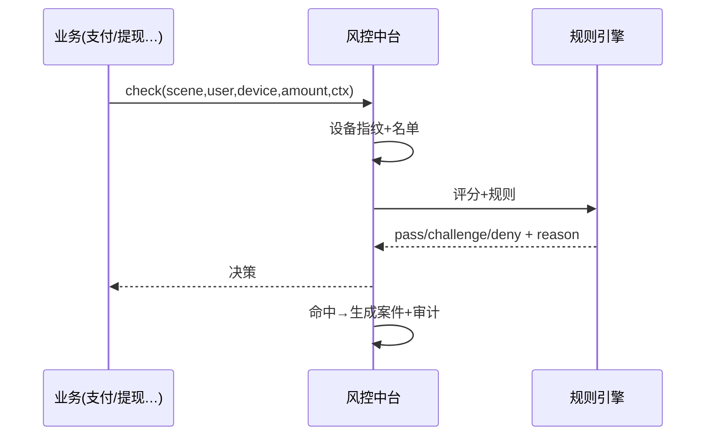

# 风控中台 · PRD

| 项 | 内容 |
|---|---|
| 版本 | v1.0 |
| 状态 | 评审稿 |
| 错误码段 | 5xxxx(与内容安全共段) |
| 依赖 | 账号(01)、支付/钱包(03/08)、投放(02,反作弊)、内容安全(06) |

---

## 一、背景与目标
统一**设备指纹、规则引擎、反欺诈、反作弊、反洗钱(AML)、名单**,被各业务实时调用做风险决策。把"哪些用户/交易/行为有风险"集中判断。

## 二、范围
| In | Out |
|---|---|
| 设备指纹、规则/评分引擎、注册登录风控、支付盗刷、行为反作弊(刷量/薅羊毛/多开)、反洗钱可疑识别、黑白灰名单、风险案件 | 内容审核(→06)、归因反作弊数据采集(→02)、KYC 实名(→支付/合规) |

## 三、整体架构


## 四、核心功能
1. **设备指纹**:识别多开、模拟器、设备农场、改机。
2. **规则引擎 + 风险评分**:可配规则(频率/金额/关联/地理),实时评分。
3. **场景风控**:注册(批量/虚假)、登录(撞库/异地)、支付(盗刷/限额)、行为(刷量/薅羊毛/自充自刷)、提现(对敲/拆分)。
4. **反洗钱(AML)**:可疑资金模式(频繁大额/异常分账/对敲)识别与上报。
5. **名单**:黑/白/灰名单,跨场景生效。
6. **案件与审计**:风险事件留痕、人工复核、申诉。

## 五、关键流程（时序）


## 六、交互原型（风控后台 · ASCII）
```
风控控制台  App:[全部▾]
规则:  注册-同设备1小时>5账号 → 拒绝         [启用]
       提现-单日>阈值且新公会 → 挑战/人审      [启用]
       支付-同卡多账号 → 标记盗刷高危          [启用]
名单:  黑名单 device/ip/card/user  共 4,210 [查] [+]
案件:  #C-771 提现对敲嫌疑 u_55→u_56 金额异常 [复核][上报]
看板:  拦截率 2.1% | 误拦申诉通过 12 | AML上报 3
```

## 七、核心接口
| 接口 | 方法 | 说明 |
|---|---|---|
| `/risk/check` | POST | 实时风险决策(scene,ctx) |
| `/risk/fingerprint` | POST | 设备指纹上报 |
| `/risk/list` | GET/POST | 名单查询/增改 |
| `/risk/case` | GET/POST | 案件 |
| `/risk/aml/report` | POST | 可疑上报 |

`5xxxx`:`51001 命中黑名单`/`51002 风险拒绝`/`51003 需二次验证`/`51004 AML可疑`。

## 八、数据模型
```
device_fp   device_id, app_id, fp_hash, signals(模拟器/改机/农场), risk_tag
risk_event  id, app_id, scene, user_id, score, decision, reason, ts
risk_list   type(black/white/grey), dim(device/ip/card/user), value, scope, reason
risk_case   id, app_id, type, related, status, handler, action
```

## 九、多产品复用与隔离
- 引擎/规则模板/名单能力共享;**风控数据与名单按 appId 隔离**(避免跨产品串号暴露关联,既防主体关联也防误伤)。可设"全局高危名单"用于跨产品防欺诈(谨慎,与隔离权衡)。

## 十、非功能 / 验收
- 实时:check P99<100ms(走缓存+规则);异步补算。
- 可解释:每次决策带 reason 供申诉。
- 验收:[ ] 设备指纹识别多开/农场;[ ] 注册/支付/提现/行为四场景风控;[ ] AML可疑识别上报;[ ] 名单+案件+申诉;[ ] 决策可解释、按appId隔离。
