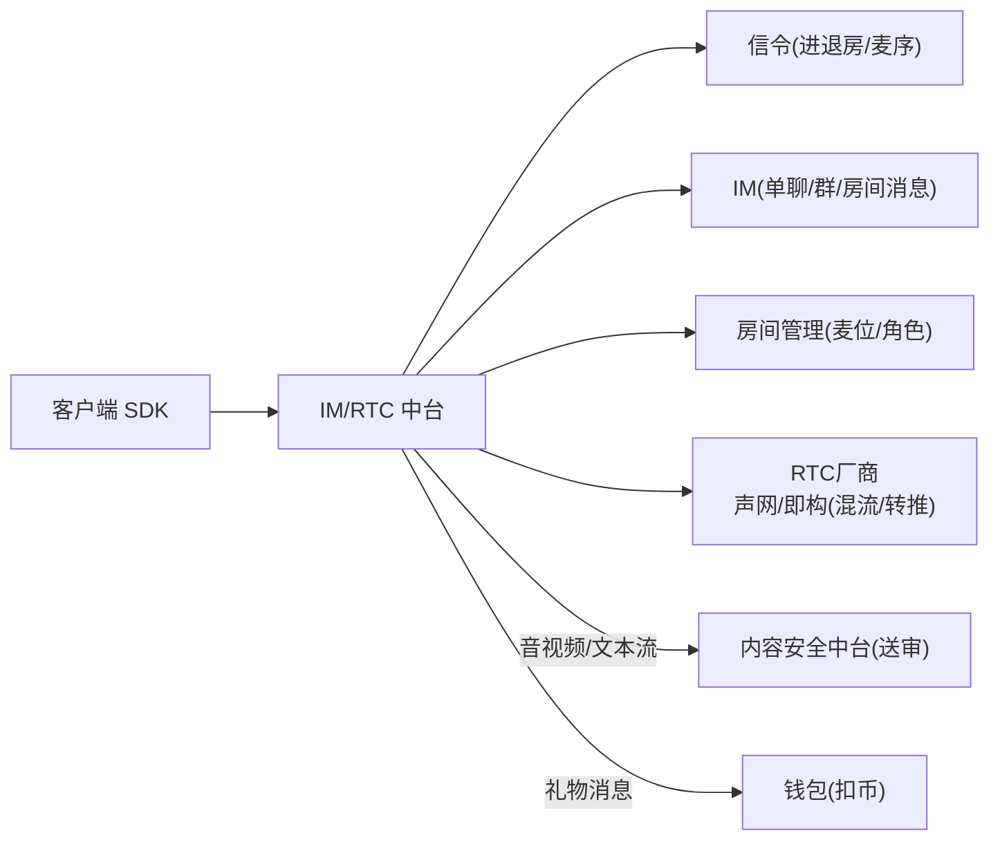
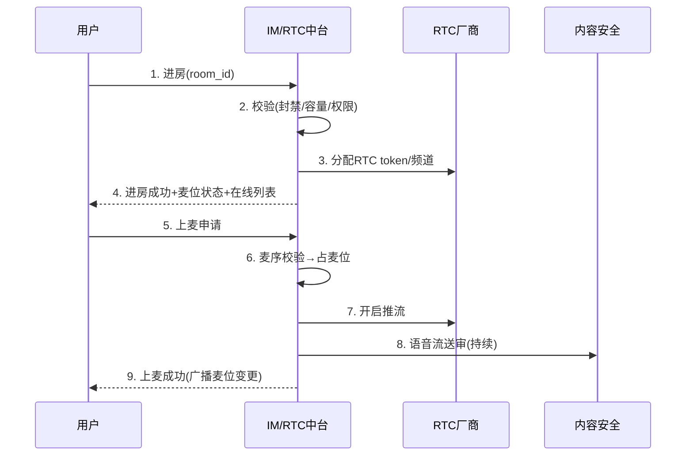
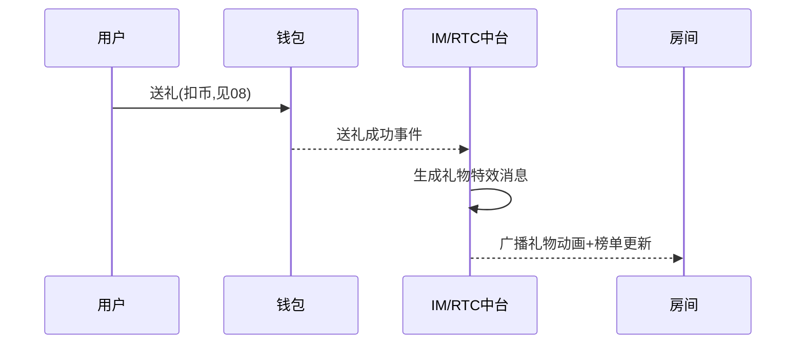

# IM / RTC 实时通信中台 · PRD

| 项 | 内容 |
|---|---|
| 版本 | v1.0 |
| 状态 | 评审稿 |
| 错误码段 | 6xxxx |
| 依赖 | 内容安全(06,流送审)、用户(07)、钱包(08,礼物消息)、账号(01) |

---

## 一、背景与目标
统一**即时消息(IM) + 语音房(RTC) + 信令**,封装声网/即构,供多产品复用。语聊房的核心体验载体。

## 二、范围
| In | Out |
|---|---|
| 单聊/群聊/房间消息、语音房(麦序/上下麦/混流)、信令、礼物/系统消息广播、房间管理、流送审对接 | RTC 底层(声网/即构 SDK)、内容审核引擎(→06)、礼物扣币(→08) |

## 三、整体架构


## 四、核心功能
1. **IM**:单聊、群聊、房间公屏、系统/通知消息;离线消息、已读、撤回。
2. **语音房(RTC)**:创建/进入/退出房间、**麦序(上麦/下麦/抱麦/踢麦/闭麦)**、混流、音量、连麦/PK。
3. **信令**:房间状态、麦位变更、在线列表实时同步。
4. **消息类型**:文本、表情、礼物特效消息、进场特效、系统广播。
5. **房间管理**:房主/管理员角色、房间设置、封禁踢人、房间类型(交友/聊天/游戏/才艺)。
6. **审核对接**:音视频/文本流实时送 06 审核;P0 秒切。
7. **PK/连麦**:跨房 PK、礼物倍率窗口(对接运营/钱包)。

## 五、关键流程（交互原型 · 时序）

### 5.1 进房 + 上麦


### 5.2 送礼消息广播


## 六、交互原型（语音房 UI · ASCII）
```
┌───────────────────────────────┐
│ ‹ 房间名·交友房   👑房主   👥328 │
│   🎤①房主  🎤②  🎤③  🎤④        │  ← 麦位(头像+音波)
│   🎤⑤  🔇⑥  ➕⑦空  ➕⑧空         │
│ ───────────────────────────── │
│ 公屏:                          │
│  系统: 欢迎 user_x 进入房间      │
│  user_y: مرحبا 大家好            │
│  🎁 user_z 送出 跑车 ×1          │  ← 礼物消息
│ ───────────────────────────── │
│ [😊][🎁礼物][🎤上麦][💬][⋯PK]   │
└───────────────────────────────┘
```

## 七、核心接口
| 接口 | 方法 | 说明 |
|---|---|---|
| `/rtc/room/enter` | POST | 进房(分配token) |
| `/rtc/room/leave` | POST | 退房 |
| `/rtc/mic/up` `/down` | POST | 上/下麦 |
| `/rtc/mic/manage` | POST | 抱麦/踢麦/闭麦 |
| `/im/message/send` | POST | 发消息(文本/礼物/系统) |
| `/im/conversation` | GET | 会话/离线消息 |
| `/rtc/pk/start` | POST | 发起PK |

`6xxxx`:`60001 房间满`/`60002 无麦位`/`60003 被封禁`/`60004 RTC分配失败`/`60005 命中审核秒切`。

## 八、数据模型
```
room        room_id, app_id, owner_id, type, status, mic_layout, member_count
mic_seat    room_id, seat_no, user_id, state(open/locked/muted)
im_message  msg_id, app_id, conv_id, from, to/room, type, content, ts
conversation conv_id, app_id, members, last_msg, unread
```

## 九、多产品复用与隔离
- IM/RTC 能力共享;房间/消息/会话按 appId 隔离;RTC 厂商账号可按 appId 分配(成本与隔离权衡)。

## 十、非功能
- 低延迟(语聊<400ms)、弱网抗丢包、就近接入(海湾/东南亚节点)。
- 高并发房间消息(扇出优化)、消息可靠(离线/重发/幂等)。
- 全程审核对接,P0 秒切。

## 十一、验收标准
- [ ] 进房/退房/麦序(上下麦/抱踢闭麦)完整,信令实时同步。
- [ ] IM 单聊/群/公屏 + 礼物/系统消息广播 + 离线/撤回。
- [ ] 语音流实时送审、P0 秒切;PK/连麦。
- [ ] 延迟/弱网达标;按 appId 隔离。
