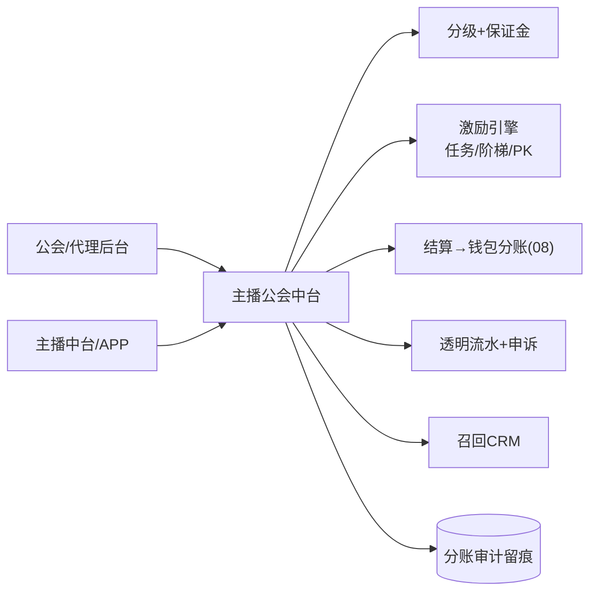
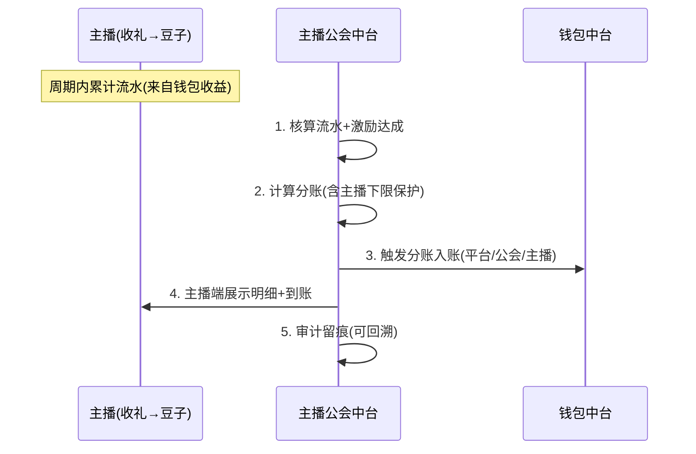
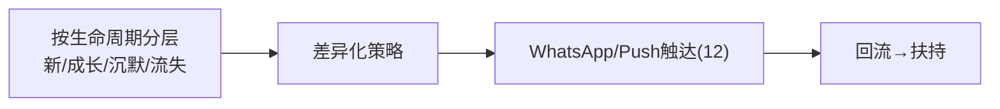

# 主播公会中台 · PRD

| 项 | 内容 |
|---|---|
| 版本 | v1.0 |
| 状态 | 评审稿 |
| 错误码段 | 7xxxx(与运营共段) |
| 依赖 | 钱包(08,分账/结算)、用户(07)、风控(09,提现/克扣)、推送(12,召回) |
| 关联 | 《06 供给侧-主播公会代理》《代理结算与分成协议模板》 |

---

## 一、背景与目标
统一**公会代理管理、主播签约、激励、结算、数据、召回**,把供给侧运营产品化。对接分成协议的"防克扣五件套"。

## 二、范围
| In | Out |
|---|---|
| 公会/代理(分级/保证金)、主播签约(代理/直签)、激励引擎(任务/流水阶梯/PK奖)、结算(对接钱包分账)、透明流水、申诉、数据看板、召回CRM | 发币/提现出款(→08)、内容审核(→06)、PK玩法(→IM/RTC) |

## 三、整体架构


## 四、核心功能
1. **公会/代理**:签约、**分级(≤2-3级)**、保证金、归属关系、违规扣罚。
2. **主播签约**:代理招募 / 平台直签;新人保护期。
3. **激励引擎**:时长任务、流水阶梯、PK/活动奖、拉新返佣;**绑定归属+设上限**。
4. **结算**:周期结算,调钱包**分账(平台/公会/主播)**,**主播分成下限保护**。
5. **透明流水**:主播端可见明细/分成/到账;**申诉通道**。
6. **审计**:全链路分账留痕,平台可回溯(防克扣)。
7. **数据看板**:公会/主播流水、开播、留存、ROI。
8. **召回 CRM**:等级/IM/生命周期/状态,分层召回(对接推送)。

## 五、关键流程（交互原型 · 时序）

### 5.1 主播流水 → 结算 → 分账


### 5.2 召回


## 六、交互原型（ASCII）

### 6.1 公会后台
```
公会管理  App:语聊房A
公会         等级  主播数  本月流水   保证金   状态
GuildAlpha   T1    42     $86,200   $5,000   ●正常
GuildBeta    T2    18     $21,400   $2,000   ⚠克扣申诉2
[新增公会] [分成配置] [违规扣罚]
```

### 6.2 主播中台（主播视角,透明结算）
```
我的收益                       本周期
  流水 🫘 52,000 ≈ $248
  我的分成比例: 55% (受下限保护✓)
  预计到手: $136
  明细: 礼物 / PK奖 / 时长任务  ›
  到账记录 ›        [有疑问?申诉]   ← 防克扣
任务: 本月开播 ✓48/60h  PK赢 3场+奖
```

### 6.3 召回 CRM
```
召回列表  App:语聊房A  筛选:[流失7天+▾]
主播     等级  WhatsApp     沉默  生命周期  状态
A_star   T1   +9665..      8天   成长期    待触达 [一键召回]
B_voice  T2   +2010..      15天  流失期    已触达 未回
策略: 流失期=情感+返场礼包;沉默期=专属激励
```

## 七、核心接口
| 接口 | 方法 | 说明 |
|---|---|---|
| `/guild/manage` | GET/POST | 公会签约/分级/保证金 |
| `/anchor/sign` | POST | 主播签约(代理/直签) |
| `/anchor/incentive` | GET | 激励进度 |
| `/guild/settle` | POST | 结算→分账(幂等) |
| `/anchor/income/detail` | GET | 透明流水 |
| `/anchor/appeal` | POST | 申诉 |
| `/anchor/recall` | GET/POST | 召回CRM |

`7xxxx`:`70101 分成低于下限拦截`/`70102 重复结算(幂等)`/`70103 保证金不足`。

## 八、数据模型
```
guild        id, app_id, tier, deposit, status
agent        id, guild_id, parent_id(≤2-3级), commission
anchor       user_id, app_id, guild_id/直签, sign_type, protect_until
settlement   id, app_id, anchor_id, period, flow, anchor_cut, guild_cut,
             platform_cut, min_guarantee_applied, status
recall       anchor_id, app_id, lifecycle, last_active, contact, status
audit_split  settlement_id, detail_json   # 防克扣审计
```

## 九、多产品复用与隔离
- 公会/激励/结算/召回模型共享;**分成/激励/保证金参数按 appId 配置**(对接分成协议模板);数据按 appId 隔离。

## 十、非功能 / 验收
- 结算幂等、分账与钱包强一致、审计可回溯。
- 提现/结算接风控(克扣/对敲/刷量,见09)。
- 验收:[ ] 公会分级(≤3)+保证金+扣罚;[ ] 主播代理/直签+新人保护;[ ] 激励绑归属+上限;[ ] 结算分账+**主播下限保护**+透明流水+申诉+审计;[ ] 召回CRM分层;[ ] 按appId配置隔离。
