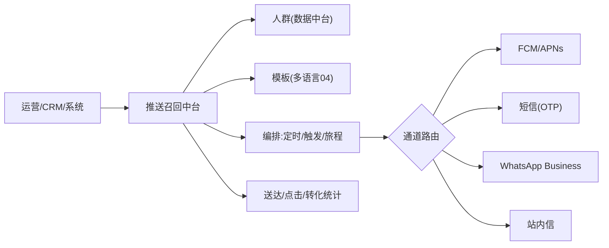
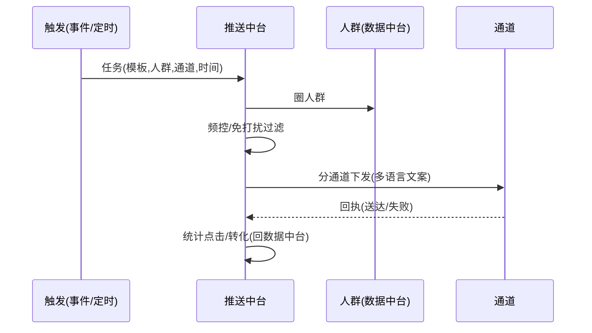

# 消息推送召回中台 · PRD

| 项 | 内容 |
|---|---|
| 版本 | v1.0 |
| 状态 | 评审稿 |
| 错误码段 | 7xxxx(与运营共段) |
| 依赖 | 多语言(04,文案)、运营(05,编排)、数据(13,人群)、账号(01,OTP)、主播公会(11,召回) |

---

## 一、背景与目标
统一**Push(FCM/APNs)、短信、WhatsApp、站内信**触达与**召回编排**,供多产品复用。也承载账号中台的 OTP 通道。

## 二、范围
| In | Out |
|---|---|
| 多通道触达、模板(多语言)、人群圈选、定时/触发/旅程编排、频控、召回策略、效果统计、OTP下发 | 人群计算源(→13)、文案翻译(→04)、召回CRM业务(→11) |

## 三、整体架构


## 四、核心功能
1. **多通道**:Push、短信、WhatsApp、站内信;通道路由与降级。
2. **模板**:多语言模板(接04)、变量、富媒体、deeplink。
3. **人群圈选**:接数据中台(标签/行为/付费层/生命周期)。
4. **编排**:定时群发、事件触发(如充值失败、流失N天)、**用户旅程(多步骤)**。
5. **频控**:全局/通道/场景频次,免打扰时段(按时区)。
6. **召回**:对接主播/用户召回策略(11),分层触达。
7. **效果**:送达/点击/转化(回流数据中台)。
8. **OTP**:为账号中台提供短信验证码通道(高优先、频控)。

## 五、关键流程（时序）


## 六、交互原型（推送后台 · ASCII）
```
触达任务  App:语聊房A  [+新建]
名称           通道      人群          时间        状态   点击率
流失7天召回     WhatsApp  流失7-14天    每日10:00   ●运行  18%
充值失败提醒    Push+站内 触发:充值失败  实时        ●运行  41%
斋月预热        Push      全部·沙特     2/1 20:00   ◷待发  —
─────────────────────────────────────────────
新建旅程: [入口:注册未首充] →(D1)Push →(D3)WhatsApp礼包 →(转化止)
频控: 每用户每日≤3条  免打扰: 当地00:00-08:00
```

## 七、核心接口
| 接口 | 方法 | 说明 |
|---|---|---|
| `/push/send` | POST | 单发/批量(模板,人群,通道) |
| `/push/journey` | POST | 旅程编排 |
| `/push/template` | GET/POST | 模板(多语言) |
| `/push/otp` | POST | OTP下发(账号中台) |
| `/push/stats` | GET | 效果统计 |
| `/push/token/register` | POST | 设备push token登记 |

`7xxxx`:`70201 频控限制`/`70202 免打扰时段`/`70203 通道失败降级`/`70204 无有效token/号码`。

## 八、数据模型
```
push_task    id, app_id, channel, template_id, audience, schedule, status
push_template id, app_id, channel, i18n_key, variables, deeplink
push_journey  id, app_id, trigger, steps_json, status
push_log     id, app_id, user_id, channel, status(sent/fail/click/convert), ts
device_push  user_id, app_id, device_id, push_token, platform
```

## 九、多产品复用与隔离
- 通道/模板/编排能力共享;**任务/人群/统计按 appId 隔离**;WhatsApp/短信账号可按 appId 配置。

## 十、非功能 / 验收
- OTP 高优先低延迟;大批量异步队列;回执与重试;隐私合规(退订/Consent)。
- 验收:[ ] 4通道下发+路由降级;[ ] 多语言模板+deeplink;[ ] 定时/触发/旅程;[ ] 频控+免打扰(时区);[ ] 效果统计回流;[ ] OTP通道;[ ] 按appId隔离。
