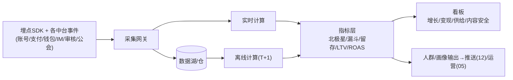
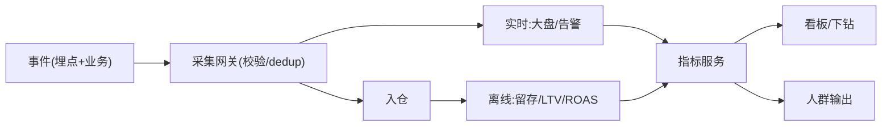

# 数据中台 · PRD

| 项 | 内容 |
|---|---|
| 版本 | v1.0 |
| 状态 | 评审稿 |
| 错误码段 | 4xxxx(与投放共段) |
| 依赖 | 全中台(埋点源)、投放(02)、运营(05,AB)、推送(12,人群) |

---

## 一、背景与目标
统一**埋点采集、数据接入、指标体系、看板、人群/画像输出**,做到 LTV/ROAS 可按 appId×国家×渠道×素材×公会×主播下钻。是所有中台的数据底座。

## 二、范围
| In | Out |
|---|---|
| 埋点SDK/规范、数据接入(行为/支付/主播/审核)、实时+离线计算、指标(北极星/漏斗/留存/LTV/ROAS)、看板、人群圈选输出、AB指标 | 归因采集(→02)、业务库(各中台)、BI 报表美化(可选三方) |

## 三、整体架构


## 四、核心功能
1. **埋点规范 + SDK**:统一公共属性(`user_id,app_id,country,language,channel,device_id,app_version,ts`)+ 事件库。
2. **数据接入**:行为埋点 + 各中台业务事件(支付/钱包/主播/审核)。
3. **实时 + 离线**:实时大盘(在线/流水)+ 离线深度(留存/LTV)。
4. **指标体系**:北极星(付费用户有效互动时长 / D7 留存付费数)、漏斗、留存、付费、LTV、ROAS。
5. **看板**:增长/变现/供给/内容安全四类(对接《14 数据与增长分析》)。
6. **人群/画像**:标签计算输出给推送/运营/匹配。
7. **AB 指标**:为运营 AB(05)提供分流指标与显著性。

## 五、关键流程（数据流）


## 六、交互原型（看板 · ASCII）

### 6.1 北极星 + 健康度漏斗
```
增长总览  App:[语聊房A▾] 国家:[沙特▾] 日期:[近7天▾]
北极星(D7留存付费用户): 4,120  ↑12%
漏斗:
  安装    52,000
  注册    41,600  (80%)
  进房    35,800  (86%)
  上麦/互动 21,300 (60%)  ← 首日有效互动
  首充     3,900  (18%)
  复充     1,700  (44%)
留存: 次留38% | 7留19% | 30留9%
```

### 6.2 变现 / 供给看板
```
变现: 流水$ | 付费率 | ARPPU | 大R占比 | 拒付率0.4%
供给: 开播主播 | 有效房间 | 黄金档覆盖 | 公会贡献Top
内容安全: 拦截量 | 举报处置时效2.1h | 漏判0
[下钻: 渠道/素材creative_id/公会/主播 ▾]
```

## 七、核心接口
| 接口 | 方法 | 说明 |
|---|---|---|
| `/data/event/report` | POST | 埋点上报(批量) |
| `/data/metric/query` | GET | 指标查询(维度下钻) |
| `/data/funnel` | GET | 漏斗 |
| `/data/retention` | GET | 留存 |
| `/data/segment` | POST | 人群圈选输出 |
| `/data/ab/result` | GET | AB指标 |

`4xxxx`:`40101 事件schema校验失败`/`40102 重复事件dedup`/`40103 指标维度无权限`。

## 八、数据模型（概念）
```
event_raw    event, app_id, user_id, props_json, ts        # 明细
dim_user     user_id, app_id, country, channel, creative_id, pay_tier, lifecycle
metric_daily app_id, date, dim(country/channel/...), metric, value
segment      id, app_id, rule_json, size                   # 人群
```

## 九、多产品复用与隔离
- 埋点规范、指标定义、看板模板**全局统一**;**数据按 appId 隔离**,支持单产品与跨产品(同主体下)汇总视图。

## 十、非功能 / 验收
- 埋点schema校验、dedup、迟到数据处理;实时大盘秒级、离线T+1。
- 口径统一(一处定义多处用),权限(RBAC按appId)。
- 验收:[ ] 公共属性+事件库统一上报;[ ] 北极星/漏斗/留存/LTV/ROAS可算;[ ] 四类看板+多维下钻(渠道/素材/公会/主播);[ ] 人群输出给推送/运营;[ ] AB指标;[ ] 按appId隔离。
