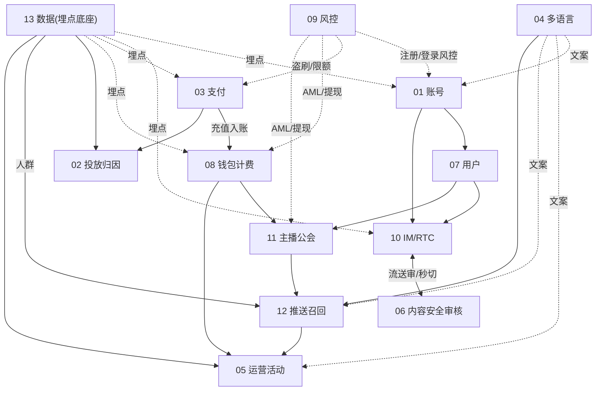
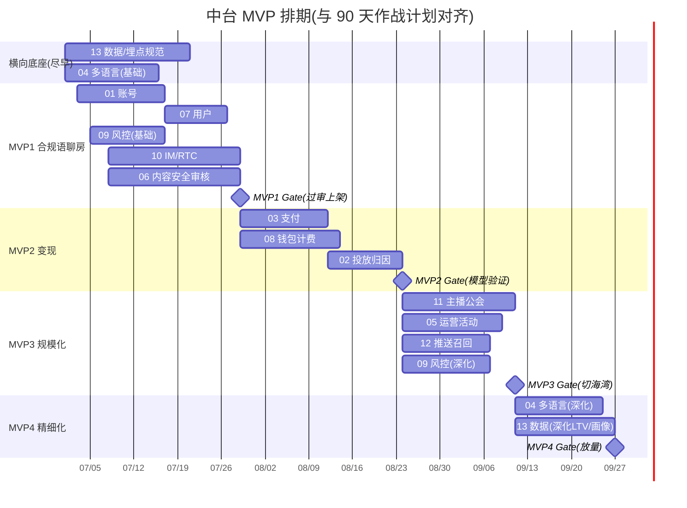

# 中台 · MVP 迭代排期与依赖拓扑

> 回答两个问题:**13 个中台先做哪个、谁依赖谁**。与《[90 天作战计划](../90天作战计划-MENA语聊房.md)》阶段对齐。
> 原则:**先能跑起来一个合规语聊房 → 再变现 → 再规模化供给/运营 → 再精细化**。

---

## 一、依赖拓扑（谁依赖谁）



**关键耦合**
- **10 IM/RTC ↔ 06 内容安全**:语音房产生流、审核秒切流,**强耦合,必须同期**(合规生死线)。
- **03 支付 → 08 钱包**:充值入账链路,**钱包依赖支付**。
- **13 数据 / 04 多语言**:横向底座,越早越好(埋点不补=后期算不出账;文案不统一=后期改 UI 痛苦)。
- **09 风控**:横切,各场景逐步接入(账号→支付→提现→行为)。

---

## 二、MVP 分期（4 期）

| 期 | 目标 | 纳入中台 | 对应 90 天阶段 |
|---|---|---|---|
| **MVP1** | 跑起来**一个合规语聊房** | 01 账号 · 07 用户 · 10 IM/RTC · **06 内容安全** · 13 数据(埋点) · 04 多语言(基础) · 09 风控(基础) | Phase1 地基 |
| **MVP2** | **能变现** | 08 钱包 · 03 支付 · 02 投放归因 | Phase2 验证 |
| **MVP3** | **规模化供给与运营** | 11 主播公会 · 05 运营活动 · 12 推送召回 · 09 风控(深化:提现/AML/反作弊) | Phase3 切海湾 |
| **MVP4** | **精细化** | 04 多语言(深化:翻译工作流/术语库) · 13 数据(深化:LTV/画像/AB) · 02 归因(回传优化) | Phase4 放量 |

> ⚠️ **MVP1 不能砍内容安全**:没有审核的真人语音房 = 上线即封号风险。06 与 10 一起上,是这套排期的铁律。

---

## 三、甘特排期（示意,按 90 天对齐）



---

## 四、关键路径（决定整体节奏）

```
13 埋点 ─┐
01 账号 ─┼→ 10 IM/RTC ＋ 06 内容安全 ──→ MVP1 Gate ──→ 03 支付 ──→ 08 钱包 ──→ MVP2 Gate ──→ 11 主播公会 ──→ MVP3 Gate
```
- **最长链路 = 关键路径**:IM/RTC + 内容安全(并行但都重)→ 支付/钱包 → 主播公会。
- **抢时间的做法**:13 埋点、04 多语言、09 风控**横向并行**,不卡关键路径;06 与 10 双线并行开发、联调期对齐。

---

## 五、每期交付物与 Gate（对接中台各 PRD 验收）

| 期 | 必达交付 | Gate(进入下一期) |
|---|---|---|
| MVP1 | 四登录、语音房进房/麦序、实时审核秒切+留证、埋点上报、基础阿语 | 海湾+埃及过审上架;审核可用;埋点可看漏斗 |
| MVP2 | IAP+本地支付收单、钱包幂等发币/送礼扣币、归因+ROAS看板 | 充值跑通;ROAS 可算;Gate2(模型验证) |
| MVP3 | 公会/主播签约结算(下限保护)、活动配置发奖、Push/WhatsApp召回 | 黄金档不空房;召回运转;Gate3(切海湾) |
| MVP4 | 翻译工作流、LTV/画像/AB | 放量纪律+多维看板成熟 |

---

## 六、团队与资源建议（按期投入）

| 期 | 重点角色 |
|---|---|
| MVP1 | 服务端×2、客户端×2、RTC×1、审核对接×1、数据×1、阿语审核外包 |
| MVP2 | +支付×1、买量优化师×1 |
| MVP3 | +公会运营(本地)、运营产品×1、客服(阿语) |
| MVP4 | +数据分析、本地化运营 |

---

## 七、风险与建议

| 风险 | 建议 |
|---|---|
| 为赶工砍 MVP1 内容安全 | ❌ 禁止;06 与 10 必须同期 |
| 埋点后补 | ❌ 算不出账;13 随 MVP1 一起 |
| 文案硬编码后期改 UI | 04 基础能力随 MVP1,先接 key-value |
| 支付未做收单主体隔离 | 03 上线即按 appId 独立商户(防关联冻结) |
| 风控一次做全 | 分场景渐进:账号→支付→提现→行为 |
| 自建 RTC 拖节奏 | MVP 用声网/即构,规模后再评估自建 |

---

## 八、一页结论

> **先用 `01+07+10+06+13+04+09(基础)` 把一个合规语聊房跑起来(MVP1)→ 加 `03+08+02` 变现(MVP2)→ 加 `11+05+12+09深化` 规模化(MVP3)→ `04+13` 精细化(MVP4)。**
> 横向底座(数据/多语言/风控)并行不卡路;内容安全与 IM/RTC 是同期铁律;支付收单主体按产品隔离。
