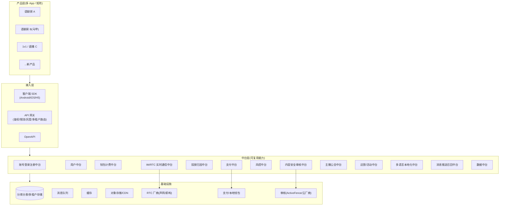
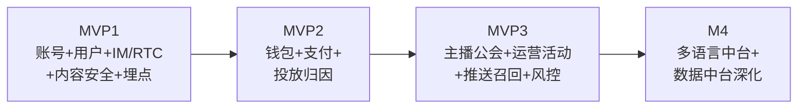

# 海外社交中台架构 · 总览（多产品可复用）

> 目标:用**一套中台**支撑**多个海外社交产品**(含矩阵/马甲包),做到"**能力复用、身份隔离**"——既享受复用降本提速,又不触发应用商店的主体关联团灭(见《03 上架与开发者账号体系》)。
> 本目录每个中台一份 PRD(含交互原型 Mermaid/线框)。本文是它们的总纲与统一规范。

---

## 一、为什么做中台

| 痛点(不做中台) | 中台解法 |
|---|---|
| 每个新产品/马甲包从零搭账号/支付/审核 | 能力沉淀,新品**接 SDK+配置**即可起量 |
| 多产品数据孤岛、无法横向比 | 统一数据/归因口径 |
| 风控/审核规则各做各的、漏洞百出 | 统一风控/内容安全策略库 |
| 上新慢 | MVP 周期从"月"降到"周" |

> ⚠️ **复用的边界**:复用的是**能力与代码**,不是**对外身份**。账号体系、支付收单主体、域名、设备/IP、归因与风控数据**必须按产品隔离**,否则一个产品违规→主体关联→矩阵团灭。这是出海社交中台与普通中台最大的不同。

---

## 二、中台全景架构



---

## 三、中台清单（13 个,⭐为你点名的 5 个）

| # | 中台 | 一句话职责 | PRD |
|---|---|---|---|
| 01 ⭐ | 账号登录注册 | 多方式登录、Token、设备、账号生命周期 | [PRD](01-账号登录注册中台-PRD.md) |
| 02 | 用户中台 | 资料、关系链、等级、画像 | [PRD](07-用户中台-PRD.md) |
| 03 | 钱包计费 | 金币/钻石/豆子、订单、对账、分账 | [PRD](08-钱包计费中台-PRD.md) |
| 04 ⭐ | 支付 | 多渠道收单、IAP、本地支付、拒付 | [PRD](03-支付中台-PRD.md) |
| 05 ⭐ | 投放归因 | 渠道、归因(MMP)、反作弊、ROAS | [PRD](02-投放归因中台-PRD.md) |
| 06 | 内容安全审核 | 机审+人审、分级、留证、举报 | [PRD](06-内容安全审核中台-PRD.md) |
| 07 | 风控 | 设备指纹、反欺诈、反洗钱 | [PRD](09-风控中台-PRD.md) |
| 08 | IM/RTC | 即时消息、语音房、信令 | [PRD](10-IM-RTC中台-PRD.md) |
| 09 | 主播公会 | 招募、分级、激励、结算、召回 | [PRD](11-主播公会中台-PRD.md) |
| 10 ⭐ | 运营/活动 | 活动、Banner、配置、AB、推送编排 | [PRD](05-运营活动中台-PRD.md) |
| 11 ⭐ | 多语言本地化 | 文案、RTL、多语言资源、翻译工作流 | [PRD](04-多语言本地化中台-PRD.md) |
| 12 | 消息推送召回 | Push/短信/WhatsApp、召回触达 | [PRD](12-消息推送召回中台-PRD.md) |
| 13 | 数据 | 埋点、归因、看板、北极星/漏斗 | [PRD](13-数据中台-PRD.md) |

---

## 四、多租户 / 多产品复用模型（核心设计）

### 4.1 维度
- **tenantId(主体/团队)** → **appId(产品/包)** → **userId(用户)**。
- 所有中台接口、数据、配置都以 **appId 为隔离维度**。

### 4.2 隔离策略（"能力共享、身份与数据隔离"）

| 维度 | 策略 |
|---|---|
| 代码/能力 | **共享**一套中台代码 |
| 业务配置 | 按 appId 配置(开关/参数/文案/玩法) |
| 用户数据 | 按 appId **逻辑隔离**(同库不同 app_id 或分库),账号**不跨 app 关联** |
| 支付收单主体 | **每产品独立**(避免主体关联,见 03/09) |
| 域名/隐私政策 | 每产品独立 |
| 设备/IP/归因 | 每产品独立采集,风控数据不串号 |
| 审核/风控策略 | 策略库共享,执行按 appId 配阈值 |

> 🔑 **一句话**:中台让你"造产品像拼乐高",但每块乐高对外**看起来是独立的公司/产品**。

### 4.3 接入方式
- **客户端**:统一 SDK(账号/支付/IM/埋点/审核上报),按 appKey 初始化。
- **服务端**:OpenAPI + Webhook 回调。
- **运营**:统一后台,按 appId + 角色权限(RBAC)切产品。

---

## 五、跨中台统一规范（所有 PRD 共用,不再各自重复）

### 5.1 API 规范
- RESTful + JSON;鉴权 `Authorization: Bearer <token>`;多租户头 `X-App-Id`, `X-Tenant-Id`。
- 统一响应:
```json
{ "code": 0, "msg": "ok", "data": {}, "trace_id": "..." }
```
- 分页:`page/page_size`;时间:UTC 毫秒时间戳;金额:最小货币单位(分)+ `currency`。

### 5.2 错误码段位（各中台分配区段）
| 段位 | 归属 |
|---|---|
| 0 | 成功 |
| 1xxxx | 通用(鉴权/参数/限流) |
| 2xxxx | 账号 |
| 3xxxx | 支付/钱包 |
| 4xxxx | 投放/归因 |
| 5xxxx | 内容安全/风控 |
| 6xxxx | IM/RTC |
| 7xxxx | 运营/活动 |
| 8xxxx | 本地化 |

### 5.3 鉴权与安全
- Token:Access(短)+ Refresh(长);设备绑定;敏感操作二次校验。
- 全链路 `trace_id`;接口签名防篡改;PII 加密存储(见合规 10 篇)。

### 5.4 埋点规范
- 公共属性:`user_id, app_id, country, language, channel, device_id, app_version, ts`(见数据中台)。

### 5.5 灰度与多区域
- 网关支持按 appId/国家/百分比灰度;多区域部署就近接入(海湾/东南亚节点)。

---

## 六、落地路线（MVP 先做哪几个）



> 原则:**先能跑起来一个合规的语聊房(账号/房间/审核/埋点)→ 再变现(钱包/支付/投放)→ 再规模化(公会/运营/风控)→ 再精细化(本地化/数据)**。对应《90 天作战计划》的阶段。

---

## 七、本目录文档导航
账号登录注册 · 投放归因 · 支付 · 多语言本地化 · 运营活动 · 内容安全审核 · 用户 · 钱包计费 · 风控 · IM/RTC · 主播公会 · 消息推送召回 · 数据 —— 各一份 PRD(含交互原型)。

> 交互原型以 **Mermaid 流程/时序图 + ASCII 线框**呈现(可在仓库直接渲染/评审)。需要高保真彩色原型可另用设计工具产出。
